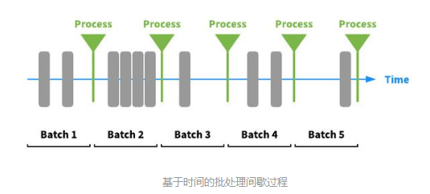
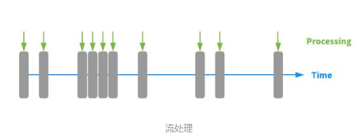

# 了解批处理，微分批处理和流处理
数据处理中心在处理新接收数据时的根本区别之一

这种区别对于处理数据的两个系统的体系结构和设计以及使用和依赖这些系统的应用程序都有重要的意义

最简单的说，基本的区别在于每一条新数据在`到达时是被处理的`，还是作为一组`新数据`的一部分`稍后处理`。这种区分将处理分为两类：批处理和流处理。

- 批处理

  在批处理中，新到达的数据元素被收集到一个组中。整个组在未来的时间进行处理（作为批处理，因此称为“批处理”）。确切地说，何时处理每个组可以用多种方式来确定

  例如，它可以基于预定的时间间隔（例如，每五分钟，处理任何新的数据已被收集）或在某些触发的条件下（例如，处理只要它包含五个数据元素或一旦它拥有超过1MB的数据）。

  

  通过类比的方式，批处理就像你的朋友（你当然知道这样的人）从干衣机中取出一大堆衣物，并简单地把所有东西都扔进一个抽屉里，只有当它很难找到东西时才分类和组织它

  这个人避免每次洗衣时都要进行分拣工作，但是他们需要花费大量时间在抽屉里搜索抽屉，并最终需要花费大量时间分离衣服，匹配袜子等。当它变得很难找到东西的时候。

  历史上，绝大多数数据处理技术都是为批处理而设计的。传统的数据仓库和Hadoop是专注于批处理的系统的两个常见示例

  术语“microbatch”经常用于描述批次小和/或以小间隔处理的情况。即使处理可能每隔几分钟发生一次，数据仍然一次处理一批

  `Spark Streaming`是设计用于支持微批处理的系统的一个例子。　　

- 流处理

  在流处理中，每一条新数据都会在到达时进行处理。与批处理不同，在下一批处理间隔之前不会等待，数据将作为单独的碎片进行处理，而不是一次处理批量  

    

  尽管每个新的数据都是单独处理的，但许多流处理系统也支持“窗口”操作，这些操作允许处理也引用在当前数据到达之前和/或之后在指定时间间隔内到达的数据。

  继续我们的比喻，组织洗衣店的流程处理方法将分类，匹配和整理从洗衣机中取出的衣物。 在这种方法中，最初对每一件衣物都进行了更多的工作，但是以后不再需要返回并重新整理整个抽屉，因为它已经组织好了，并且不再浪费时间搜寻 用于埋藏衣物的抽屉。

  有越来越多的系统设计用于流处理，包括`Apache Storm`和`Apache Heron`。 这些系统经常部署以支持近乎实时的事件处理。

- 批处理和流处理之间差异的含义

  尽管流处理和批处理（特别是微批处理）之间的差异似乎只是时间差异很小的问题，但它们实际上对数据处理系统的体系结构和使用它们的应用程序都有着根本的影响。

  `流处理`系统的设计是为了在数据到达时对其进行响应。这就要求它们实现一个由事件驱动的体系结构, 即系统的内部工作流设计为在接收到数据后立即连续监视新数据和调度处理。

  另一方面, `批处理`系统中的内部工作流只定期检查新数据, 并且只在下一个批处理窗口发生时处理该数据。

  `流处理`和`批处理`之间的差异对于应用程序来说也是非常重要的

  为批处理而构建的应用程序，通过定义处理数据，具有延迟性。在具有多个步骤的数据管道中，这些延迟会累积。此外，新数据的到达与该数据的处理之间的延迟将取决于直到下一批处理窗口的时间--从在某些情况下完全没有时间到批处理窗口之间的全部时间不等，这些数据是在批处理开始后到达的。因此，批处理应用程序(及其用户)不能依赖一致的响应时间，需要相应地调整以适应这种不一致性和更大的延迟

  批量处理通常适用于具有最新数据并不重要的用例，以及容忍较慢响应时间的情况。 例如，对历史数据进行离线分析以计算结果或识别相关性是一种常见的批处理用例。　　另一方面，流处理对于需要实时交互和实时响应的用例是必需的。 金融交易处理，实时欺诈检测和实时定价是最适合流处理的示例。

  来源：[百度](https://baijiahao.baidu.com/s?id=1598791080876078982&wfr=spider&for=pc)
