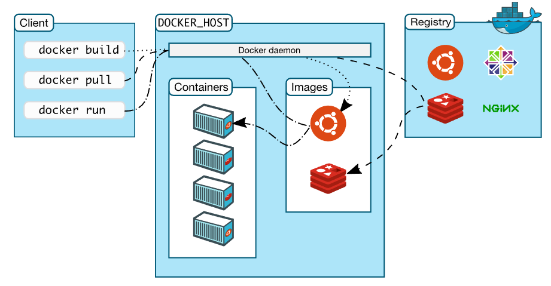

# 介绍

`Docker`是一个`Client-Server`应用，组件包括：
- `server` 守护进程
- `RestAPI`
- `CLI` 命令行

## Docker能做什么
- 快速、持续交付
- 响应式部署和扩展
- 可以在同一机器上运行更多的应用

## Docker架构

- Docker daemon

    守护线程（`dockerd`）监听`Docker API`请求和管理`Docker`的对象，如`images`,`containers`,`networks`,`volumes`。守护线程
    同时也与其他守护线程进行通讯来对`Docker Services`进行管理。

- Docker client

    `client`用来将命令，如`docker run`发送到`dockerd`

- Docker registries

    `Docker`仓库。 `Docker Hub`是一个公共的仓库，`Docker`默认都是从`Docker Hub`去查找镜像(`images`)的。

    运行`docker pull`或才`docker run`时，依赖的镜像(`images`)会从配置的创建中`pull`。

    运行`docker push`，会将镜像(`images`)推到配置的仓库中。

- Docker objects

    - images 一个用来创建`Container`的只读模板
        可以使用`Dockerfile`来定义步骤和依赖来制定一个镜像

    - containers 容器是一个镜像的可运行实例
        你可以使用`Docker API`或者`CLI`创建、启动、停止、移动或者删除。

        `container`创建或者启动的时候是根据镜像配置的配置信息做为预配置的，当你删除时，修改的配置信息并不会保存，而是会永久消息。
    - services
        集群时，用来管理多个`Docker daemons`
