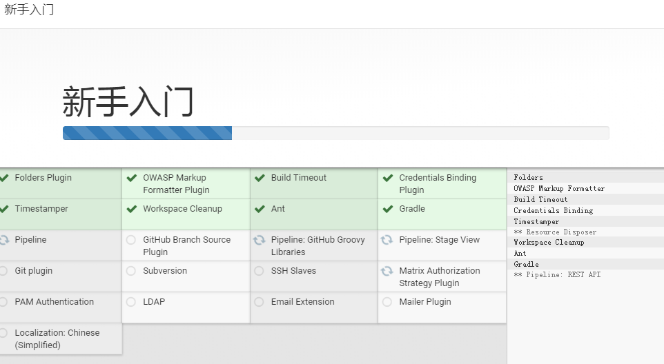

# 安装Jenkins

## Docker安装
### 查看镜像版本
`docker search jenkins`

### 拉取镜像
`docker pull jenkinsci/blueocean`

### 查看镜像
`docker image ls`

### 创建注册服务器容器
```
docker run \
  -u root \
  -d \
  -p 4001:8080 \
  -p 40001:50000 \
  -v /data/docker/jenkins_home:/var/jenkins_home \
  -v /var/run/docker.sock:/var/run/docker.sock \
  -v /data/apache-maven-3.5.0:/var/maven \
  jenkinsci/blueocean
```
##### 参数说明
- `-d` 后台运行
- `-p 4001:8080` 外部4001映射容器8080
- `-p 40001:50000` 外部40001映射容器50000（集群时交互）
- `-v /data/docker/jenkins:/var/jenkins_home` 配置外部/data/docker/jenkins目录挂载到容器/var/jenkins_home
- `-v /var/run/docker.sock:/var/run/docker.sock`
var/run/docker.sock表示Docker守护程序通过其监听的基于Unix的套接字。
该映射允许容器与Docker守护进程通信， 如果容器需要实例化其他Docker容器，则该守护进程是必需的。
- `-v /data/apache-maven-3.5.0:/var/maven` 配置Maven映射
- `jenkinsci/blueocean` 镜像

### 查看当前运行
`docker ps`


 ## 安装后使用
 `http://192.168.1.209:4001/`

### 复制密码
`/var/jenkins_home/secrets/initialAdminPassword`

在`Docker`安装时的目录挂载为`/data/docker/jenkins_home`，所以对应目录为
`/data/docker/jenkins_home/secrets/initialAdminPassword`

### 初始化
- 初始化过程需要一点时间.....  
- 安装社区推荐插件....
      
- 创建管理员
- 初始化完成
> 由于安装使用的是`jenkinsci/blueocean`版本，很多插件已经安装完成，不需要额外的多余插件管理过程

## GitLab整合Jenkins示例
> 参考 [How to Integrate Your GitHub Repository to Your Jenkins](https://dzone.com/articles/how-to-integrate-your-github-repository-to-your-je)
>
> 参考[Microservices and DevOps Using Java, Spring Boot, Git Flow, Jenkins, and Docker](https://dzone.com/articles/microservices-and-devops-1)

### Jenkins
#### 安装插件
- GitLab
- GitLab Hook
> 插件安装很容易失败，建议直接选择`直接安装`，如果选择`下载后等待重启安装`很难下载成功
#### New Item（新建Item）
- JobName: magneton-mico-job
- Type: maven project

#### General
- 丢弃旧的构建
    设置保持7天，7个最大构建数

##### Source Code Manager（源码管理）
- 选择Git
- 复制Git仓库地址到`RepositoryURL`
    输入 http://git.atenops.com/magneton-service/magneton-micro.git  
    ```
    Q: 无法连接仓库：Command "git ls-remote -h -- http://git.atenops.com/magneton-service/magneton-micro.git HEAD" returned status code 128:
    stdout:
    stderr: remote: HTTP Basic: Access denied
    fatal: Authentication failed for 'http://git.atenops.com/magneton-service/magneton-micro.git/'

    A: 添加授权
    ```
##### Build Trigger(构建触发器)
- 选择 Build when a change is pushed to GitLab. GitLab webhook URL: `http://192.168.1.209:4001/project/magneton-job`（这个地址就是GitLab要填写的WebHook地址
）
- 高级
    - Filter branches by regex 配置 `.*master` 只有`master`触发
    - Secret token 生成，如 `3aac2e72e847a90db5840d3cb2b1e67c`

##### Pre Steps
- 选择 `Execute shell`
- 执行shell命令： `echo "build success test\n" >> /var/jenkins_home/build_success_test.log`

##### Build（构建）
- pom: pom.xml

### GitLab
- 设置-集成
    - 链接URL：`http://192.168.1.209:4001/project/magneton-job`（Jenkins生成的）
    - 安全令牌：`3aac2e72e847a90db5840d3cb2b1e67c`（高级中生成的SecretToken）
    - 保存
- Tests 测试
