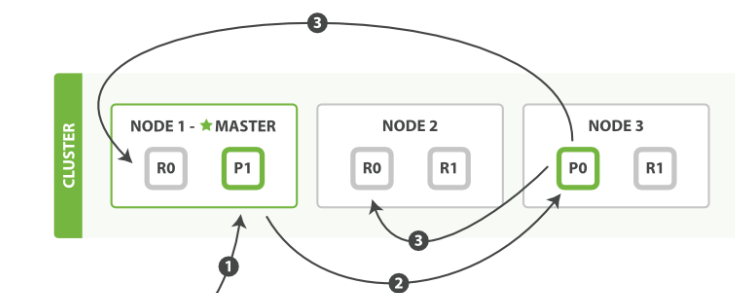
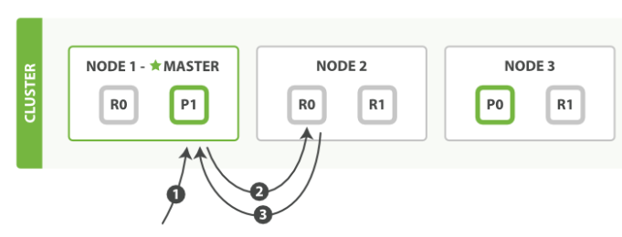
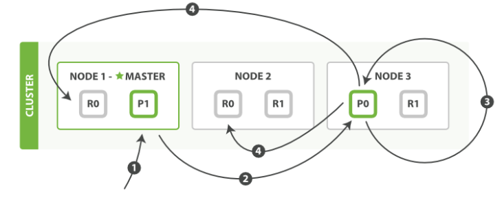
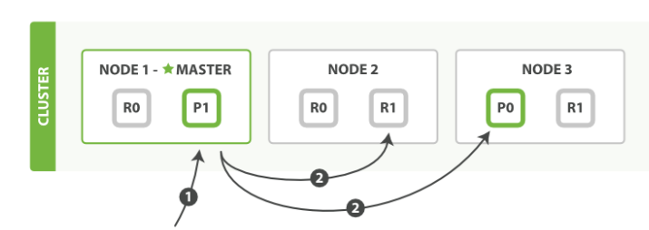
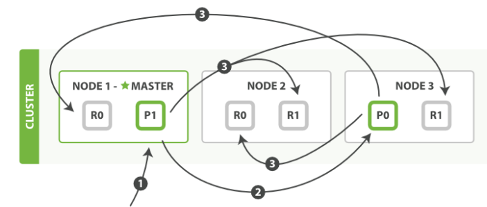

# ElasticSearch入门

## 认识ElasticSearch
#### 面向文档
Elasticsearch 是 `面向文档` 的，意味着它存储整个对象或 文档。Elasticsearch 不仅存储文档，而且 索引 每个文档的内容，使之可以被检索。在 Elasticsearch 中，我们对文档进行索引、检索、排序和过滤—​而不是对行列数据。这是一种完全不同的思考数据的方式，也是 Elasticsearch 能支持复杂全文检索的原因。
###### 什么是文档?
在大多数应用中，多数实体或对象可以被序列化为包含键值对的 JSON 对象。 一个 键 可以是一个字段或字段的名称，一个 值 可以是一个字符串，一个数字，一个布尔值， 另一个对象，一些数组值，或一些其它特殊类型诸如表示日期的字符串，或代表一个地理位置的对象。

#### JSON
Elasticsearch 使用 JavaScript Object Notation（或者 JSON）作为文档的序列化格式。JSON 序列化为大多数编程语言所支持，并且已经成为 NoSQL 领域的标准格式。 它简单、简洁、易于阅读。

#### 索引

 存储数据到 Elasticsearch 的行为叫做`索引` ，但在索引一个文档之前，需要确定将文档存储在哪里。

一个 Elasticsearch 集群可以 包含多个`索引` ，相应的每个索引可以包含多个`类型` 。 这些不同的类型存储着多个`文档` ，每个文档又有多个`属性` 。

`索引`（名词）：

如前所述，一个`索引`类似于传统关系数据库中的一个`数据库` ，是一个存储关系型文档的地方。 索引 (index) 的复数词为 indices 或 indexes 。

`索引`（动词）：

索引一个`文档`就是存储一个文档到一个`索引 （名词）`中以便被检索和查询。这非常类似于`SQL`语句中的`INSERT`关键词，除了文档已存在时，新文档会替换旧文档情况之外。

`倒排索引`：

关系型数据库通过增加一个`索引`比如一个`B树（B-tree）`索引到`指定的列`上，以便提升数据检索速度。`Elasticsearch` 和 `Lucene` 使用了一个叫做`倒排索引`的结构来达到相同的目的。

`倒排索引`适用于快速的全文搜索。一个倒排索引由文档中所有不重复词的列表构成，对于其中每个词，有一个包含它的文档列表。

## 检索文档
根据Id检索：`GET /{_index}/{_type}/{_id}`  
根据范围检索：`GET /{_index}/{_type}/_search`  
条件检索：`GET /{_index}/{_type}/_search?q=keyName:keyValue`  

如：`GET /megacorp/employee/_search?q=last_name:Smith` 表示检索`index=megacorp`, `type=employee`中`_source(文档中数据).last_name(Key)=Smith(Value)`

#### 查询表达式
`POST /{_index}/{_type}_search`  
```json
{
    "query" : {
            "match": {
                "last_name" : "Smith"
            }
    }
}
```
#### 相关表达式
###### 过滤器`filter`
```json
{
    "query": ....,
    "filter": {
        "range" : {
            "age" : {"gt" : 30}
        }
    }
}
```
###### 短语搜索`match_phrase`
找出一个属性中的独立单词是没有问题的，但有时候想要精确匹配一系列单词或者_短语_ 。 比如， 我们想执行这样一个查询，仅匹配同时包含 `“rock”` 和 `“climbing”` ，并且 二者以短语 `“rock climbing”` 的形式紧挨着的雇员记录。
```json
{
    "query":{
        "match_phrase": ...
    }
}
```
###### 高亮`highlight`
高亮查询条件中`about`属性匹配的文本版本
```json
{
    "query": ...,
    "highlight":{
        "fields": {
            "about": {}
        }
    }
}
```
###### 分析
 Elasticsearch 有一个功能叫聚合（`aggregations`），允许我们基于数据生成一些精细的分析结果。聚合与`SQL`中的`GROUP BY`类似但更强大。

## 集群
一个运行中的 Elasticsearch 实例称为一个`节点`，而集群是由一个或者多个拥有相同 `cluster.name` 配置的节点组成， 它们共同承担数据和负载的压力。当有节点加入集群中或者从集群中移除节点时，集群将会重新平均分布所有的数据。

当一个节点被选举成为 `主` 节点时， 它将负责管理集群范围内的所有变更，例如增加、删除索引，或者增加、删除节点等。 而主节点并不需要涉及到文档级别的变更和搜索等操作，所以当集群只拥有一个主节点的情况下，即使流量的增加它也不会成为瓶颈。 任何节点都可以成为主节点。

作为用户，我们可以将请求发送到 `集群中的任何节点` ，包括主节点。 每个节点都知道任意文档所处的位置，并且能够将我们的请求直接转发到存储我们所需文档的节点。 无论我们将请求发送到哪个节点，它都能负责从各个包含我们所需文档的节点收集回数据，并将最终结果返回給客户端。 Elasticsearch 对这一切的管理都是透明的。
#### 集群健康`GET /_cluster/health`
Elasticsearch 的集群监控信息中包含了许多的统计数据，其中最为重要的一项就是 `集群健康` ， 它在 `status` 字段中展示为 `green` 、 `yellow` 或者 `red` 。  
`green`  
所有的主分片和副本分片都正常运行。  
`yellow`  
所有的主分片都正常运行，但不是所有的副本分片都正常运行。  
`red`  
有主分片没能正常运行。  

## 索引
我们往 `Elasticsearch` 添加数据时需要用到 `索引` —— 保存相关数据的地方。 索引实际上是指向一个或者多个物理 `分片` 的 逻辑命名空间 。

一个 `分片` 是一个底层的 `工作单元` ，它仅保存了全部数据中的一部分。

Elasticsearch 是利用分片将数据分发到集群内各处的。分片是数据的容器，文档保存在分片内，分片又被分配到集群内的各个节点里。 当你的集群规模扩大或者缩小时， Elasticsearch 会自动的在各节点中迁移分片，使得数据仍然均匀分布在集群里。

一个分片可以是 `主` 分片或者 `副本` 分片。 索引内任意一个文档都归属于一个主分片，所以主分片的数目决定着索引能够保存的最大数据量。

一个副本分片只是一个主分片的拷贝。副本分片作为硬件故障时保护数据不丢失的冗余备份，并为搜索和返回文档等读操作提供服务。

在 **`索引建立的时候就已经确定了主分片数`** ，但是副本分片数可以随时修改。

>
> 当索引一个文档的时候，文档会被存储到一个主分片中
>
> shard = hash(routing) % number_of_primary_shards
>
> routing 是一个可变值，默认是文档的 `_id` ，也可以设置成一个自定义的值。 `routing` 通过
> `hash` 函数生成一个数字，然后这个数字再除以 `number_of_primary_shards` （主分片的数量）后得
> 到 余数 。这个分布在 `0` 到 `number_of_primary_shards-1` 之间的余数，就是我们所寻求的文档
> 所在分片的位置。
>
> 这就解释了为什么我们要在创建索引的时候就确定好主分片的数量 并且永远不会改变这个数量：因为
> 如果数量变化了，那么所有之前路由的值都会无效，文档也再也找不到了。
>  


```json
PUT /blogs
{
   "settings" : {
      "number_of_shards" : 3,
      "number_of_replicas" : 1
   }
}
```

索引在默认情况下会被分配为`5`个主分片，在上面的配置中，分配了`3`个主分片和一份副本（每个主份片一个副本），此时集群的健康状态为是`yellow`，表示全部 `主` 分片都正常运行（集群可以正常服务所有请求），但是 `副本` 分片没有全部处在正常状态。 实际上，所有3个副本分片都是 `unassigned` —— 它们都没有被分配到任何节点。 在同一个节点上既保存原始数据又保存副本是没有意义的，因为一旦失去了那个节点，我们也将丢失该节点上的所有副本数据。如果接入其他节点，则`副本`分片会自动分配到其他节点中。

## 水平扩展
主分片的数目在索引创建时就已经确定了下来。实际上，这个数目定义了这个索引能够 `存储` 的最大数据量。（实际大小取决于你的数据、硬件和使用场景。） 但是，读操作——搜索和返回数据——可以同时被`主分片` 或` 副本分片`所处理，所以当你`拥有越多的副本分片时，也将拥有越高的吞吐量`。

在运行中的集群上是可以动态调整副本分片数目的，我们可以按需伸缩集群。让我们把副本数从默认的 1 增加到 2 ：
```json
PUT /blogs/_settings
{
   "number_of_replicas" : 2
}
```
将参数 number_of_replicas 调大到 2， blogs 索引现在拥有9个分片：3个主分片和6个副本分片。 这意味着我们可以将集群扩容到9个节点，每个节点上一个分片。相比原来3个节点时，集群搜索性能可以提升 `3` 倍。

当然，如果`只是在相同节点数目的集群上增加更多的副本分片并不能提高性能`，因为每个分片从节点上获得的资源会变少。 你需要增加更多的硬件资源来提升吞吐量。

但是更多的副本分片数提高了数据冗余量：按照上面的节点配置，我们可以在失去2个节点的情况下不丢失任何数据。

## 主副分片交互

#### 在主副分片和任何副本分片上面 成功新建，索引和删除文档所需要的步骤顺序：


- 客户端向` Node 1` 发送新建、索引或者删除请求。
- 节点使用文档的 `_id` 确定文档属于分片 `0` 。请求会被转发到 `Node 3`，因为分片 `0` 的主分片目前被分配在 `Node 3` 上。
- `Node 3` 在主分片上面执行请求。如果成功了，它将请求并行转发到 `Node 1` 和 `Node 2` 的副本分片上。一旦所有的副本分片都报告成功, `Node 3` 将向协调节点报告成功，协调节点向客户端报告成功。
在客户端收到成功响应时，文档变更已经在主分片和所有副本分片执行完成，变更是安全的。

有一些可选的请求参数允许您影响这个过程，可能以数据安全为代价提升性能。这些选项很少使用，因为Elasticsearch已经很快，但是为了完整起见，在这里阐述如下：

`consistency`
consistency，即一致性。在默认设置下，即使仅仅是在试图执行一个_写_操作之前，主分片都会要求 必须要有 规定数量(quorum)（或者换种说法，也即必须要有大多数）的分片副本处于活跃可用状态，才会去执行_写_操作(其中分片副本可以是主分片或者副本分片)。这是为了避免在发生网络分区故障（network partition）的时候进行_写_操作，进而导致数据不一致。`_规定数量_`即：

`int( (primary + number_of_replicas) / 2 ) + 1`

consistency 参数的值可以设为 `one` （只要主分片状态 ok 就允许执行_写_操作）,`all`（必须要主分片和所有副本分片的状态没问题才允许执行_写_操作）, 或 `quorum` 。默认值为 `quorum` , 即大多数的分片副本状态没问题就允许执行_写_操作。

注意，规定数量 的计算公式中 `number_of_replicas` 指的是在索引设置中的设定副本分片数，而不是指当前处理活动状态的副本分片数。如果你的索引设置中指定了当前索引拥有三个副本分片，那规定数量的计算结果即：

`int( (primary + 3 replicas) / 2 ) + 1 = 3`

如果此时你只启动两个节点，那么处于活跃状态的分片副本数量就达不到规定数量，也因此您将无法索引和删除任何文档。

`timeout`
如果没有足够的副本分片会发生什么？ Elasticsearch会等待，希望更多的分片出现。默认情况下，它最多等待1分钟。 如果你需要，你可以使用 `timeout` 参数 使它更早终止： `100` 100毫秒，`30s` 是30秒。

```
新索引默认有 1 个副本分片，这意味着为满足 规定数量 应该 需要两个活动的分片副本。 但是，这些默认的设置会阻止我们在单一节点上做任何事情。为了避免这个问题，要求只有当 number_of_replicas 大于1的时候，规定数量才会执行。
```
#### 取回一个文档,主分片或者副本分片检索文档的步骤顺序


- 客户端向 Node 1 发送获取请求。

- 节点使用文档的 `_id` 来确定文档属于分片 `0` 。分片 `0` 的副本分片存在于所有的三个节点上。 在这种情况下，它将请求转发到 `Node 2` 。

- `Node 2` 将文档返回给 `Node 1` ，然后将文档返回给客户端。

在处理读取请求时，协调结点在每次请求的时候都会通过轮询所有的副本分片来达到负载均衡。

在文档被检索时，已经被索引的文档可能已经存在于主分片上但是还没有复制到副本分片。 在这种情况下，副本分片可能会报告文档不存在，但是主分片可能成功返回文档。 一旦索引请求成功返回给用户，文档在主分片和副本分片都是可用的。

#### 局部更新文档


- 客户端向` Node 1` 发送更新请求。
- 它将请求转发到主分片所在的 `Node 3` 。
- `Node 3 `从主分片检索文档，修改 `_source` 字段中的 JSON ，并且尝试重新索引主分片的文档。 如果文档已经被另一个进程修改，它会重试步骤 `3` ，超过 `retry_on_conflict` 次后放弃。
如果 `Node 3` 成功地更新文档，它将新版本的文档并行转发到 `Node 1` 和 `Node 2`上的副本分片，重新建立索引。 一旦所有副本分片都返回成功， `Node 3` 向协调节点也返回成功，协调节点向客户端返回成功。

#### 多文档
`mget` 和 `bulk` API 的模式类似于单文档模式。区别在于协调节点知道每个文档存在于哪个分片中。 它将整个多文档请求分解成 每个分片 的多文档请求，并且将这些请求并行转发到每个参与节点。

协调节点一旦收到来自每个节点的应答，就将每个节点的响应收集整理成单个响应，返回给客户端。

###### `mget`取回多个文档

- 客户端向 `Node 1` 发送 `mget` 请求。
- `Node 1` 为每个分片构建多文档获取请求，然后并行转发这些请求到托管在每个所需的主分片或者副本分片的节点上。一旦收到所有答复， `Node 1` 构建响应并将其返回给客户端。

可以对 `docs` 数组中每个文档设置 `routing` 参数。

###### `bluk`修改多个文档
允许在单个批量请求中执行多个创建、索引、删除和更新请求。

- 客户端向 `Node 1` 发送 `bulk` 请求。
- `Node 1` 为每个节点创建一个批量请求，并将这些请求并行转发到每个包含主分片的节点主机。
- 主分片一个接一个按顺序执行每个操作。当每个操作成功时，主分片并行转发新文档（或删除）到副本分片，然后执行下一个操作。 一旦所有的副本分片报告所有操作成功，该节点将向协调节点报告成功，协调节点将这些响应收集整理并返回给客户端。

`bulk` API 还可以在整个批量请求的最顶层使用 `consistency` 参数，以及在每个请求中的元数据中使用 `routing` 参数。

#### 查询过程分布式搜索

- 客户端发送一个 `search` 请求到 `Node 3` ， `Node 3` 会创建一个大小为 `from + size` 的空优先队列。
- `Node 3` 将查询请求转发到索引的每个主分片或副本分片中。每个分片在本地执行查询并添加结果到大小为 `from + size` 的本地有序优先队列中。
- 每个分片返回各自优先队列中所有文档的 `ID` 和排序值给协调节点，也就是 `Node 3` ，它合并这些值到自己的优先队列中来产生一个全局排序后的结果列表。

当一个搜索请求被发送到某个节点时，这个节点就变成了协调节点。 这个节点的任务是广播查询请求到所有相关分片并将它们的响应整合成全局排序后的结果集合，这个结果集合会返回给客户端。

第一步是广播请求到索引中每一个节点的分片拷贝。

 查询请求可以被某个主分片或某个副本分片处理， 这就是为什么更多的副本（当结合更多的硬件）能够增加搜索吞吐率。 协调节点将在之后的请求中轮询所有的分片拷贝来分摊负载。

 每个分片在本地执行查询请求并且创建一个长度为 `from + size` 的优先队列—也就是说，每个分片创建的结果集足够大，均可以满足全局的搜索请求。 分片返回一个轻量级的结果列表到协调节点，它仅包含文档 `ID` 集合以及任何排序需要用到的值，例如 `_score` 。

 协调节点将这些分片级的结果合并到自己的有序优先队列里，它代表了全局排序结果集合。至此查询过程结束。

 ```
一个索引可以由一个或几个主分片组成， 所以一个针对单个索引的搜索请求需要能够把来自多个分片的结果组合起来。 针对 multiple 或者 all 索引的搜索工作方式也是完全一致的—​仅仅是包含了更多的分片而已。
 ```

 #### 分布式搜索的取回阶段
 

- 协调节点辨别出哪些文档需要被取回并向相关的分片提交多个 `GET` 请求。
- 每个分片加载并 `丰富` 文档，如果有需要的话，接着返回文档给协调节点。
- 一旦所有的文档都被取回了，协调节点返回结果给客户端。

协调节点首先决定哪些文档 确实 需要被取回。例如，如果我们的查询指定了 `{ "from": 90, "size": 10 }` ，最初的`90`个结果会被丢弃，只有从第`91`个开始的`10`个结果需要被取回。这些文档可能来自和最初搜索请求有关的一个、多个甚至全部分片。

协调节点给持有相关文档的每个分片创建一个`multi-get request` ，并发送请求给同样处理查询阶段的分片副本。

分片加载文档体-- `_source` 字段—​如果有需要，用元数据和 `search snippet highlighting` 丰富结果文档。 一旦协调节点接收到所有的结果文档，它就组装这些结果为单个响应返回给客户端。

#### 游标查询`Scroll`

`scroll` 查询 可以用来对 `Elasticsearch` 有效地执行大批量的文档查询，而又不用付出深度分页那种代价。

游标查询允许我们 先做查询初始化，然后再批量地拉取结果。 这有点儿像传统数据库中的 `cursor` 。

游标查询会取某个时间点的快照数据。 查询初始化之后索引上的任何变化会被它忽略。 它通过保存旧的数据文件来实现这个特性，结果就像保留初始化时的索引 视图 一样。

深度分页的代价根源是结果集全局排序，如果去掉全局排序的特性的话查询结果的成本就会很低。 游标查询用字段 `_doc` 来排序。 这个指令让 `Elasticsearch` 仅仅从还有结果的分片返回下一批结果。

启用游标查询可以通过在查询的时候设置参数 `scroll` 的值为我们期望的游标查询的过期时间。 游标查询的过期时间会在每次做查询的时候刷新，所以这个时间只需要足够处理当前批的结果就可以了，而不是处理查询结果的所有文档的所需时间。 这个过期时间的参数很重要，因为保持这个游标查询窗口需要消耗资源，所以我们期望如果不再需要维护这种资源就该早点儿释放掉。 设置这个超时能够让 `Elasticsearch` 在稍后空闲的时候自动释放这部分资源。

```json
GET /old_index/_search?scroll=1m
{
    "query": { "match_all": {}},
    "sort" : ["_doc"],
    "size":  1000
}
```
- `1m` 保持游标查询窗口一分钟。
- `_doc` 关键字 `_doc` 是最有效的排序顺序。

这个查询的返回结果包括一个字段 `_scroll_id，` 它是一个`base64`编码的长字符串 。 现在我们能传递字段 `_scroll_id` 到 `_search/scroll` 查询接口获取下一批结果：
```json
GET /_search/scroll
{
    "scroll": "1m",
    "scroll_id" : "cXVlcnlUaGVuRmV0Y2g7NTsxMDk5NDpkUmpiR2FjOFNhNnlCM1ZDMWpWYnRROzEwOTk1OmRSamJHYWM4U2E2eUIzVkMxalZidFE7MTA5OTM6ZFJqYkdhYzhTYTZ5QjNWQzFqVmJ0UTsxMTE5MDpBVUtwN2lxc1FLZV8yRGVjWlI2QUVBOzEwOTk2OmRSamJHYWM4U2E2eUIzVkMxalZidFE7MDs="
}
```
- `1m` 注意再次设置游标查询过期时间为一分钟。
这个游标查询返回的下一批结果。 尽管我们指定字段 `size` 的值为`1000`，我们有可能取到超过这个值数量的文档。 当查询的时候， 字段 `size` 作用于单个分片，所以每个批次实际返回的文档数量最大为 `size * number_of_primary_shards` 。

注意游标查询每次返回一个新字段 `_scroll_id`。每次我们做下一次游标查询， 我们必须把前一次查询返回的字段 `_scroll_id` 传递进去。 当没有更多的结果返回的时候，我们就处理完所有匹配的文档了。
