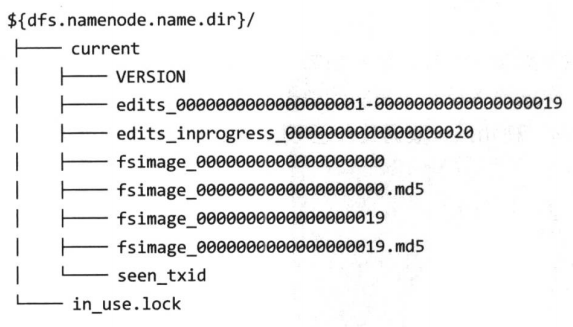
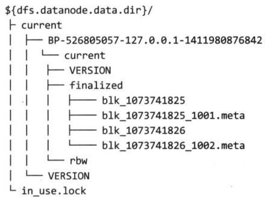

# HDFS永久性数据结构

- `namenode`的目录结构

  

  - `VERSION`文件是一个`java`属性文件，其中包含正在运行的`HDFS`的版本信息。该文件一般包含以下内容

    ```
    #Mon Sep 29 09:54:36 BST 2014
    namespaceID=1342387246
    clusterID=CID-01b5c398-959c-4ea8-aae6-1e0d9bd8b142
    cTime=0
    storeageType=NAME_NODE
    blockpoolID=BP-526805057-127.0.0.1-1411980876842
    layoutVersion=-57
    ```
    `layoutVersion`是一个负整数，描述`HDFS`持久性数据结构（也行布局）的版本，但是该版本号与`Hadoop`发布包的版本号无关。 只要布局变更，版本号便会递减，此时，HDFS也需要升级。 否则，磁盘仍然使用旧版本的布局，新版本的`namenode`（或`datanode`)也就无法正常工作。

    `namespaceID`是文件系统命名空间的唯一标识符，是在`namenode`首次格式化时创建的

    `clusterID`是将`HDFS`集群作为一个整体赋予的唯一标识，对于联邦`HDFS`非常重要，这里一个集群由多个命名空间组成，且每个命名空间由一个`namenode`管理

    `blockpoolID` 是数据块池的唯一标识符，数据块池中包含了由一个`namenode`管理的命名空间中的所有文件

    `cTime`属性标识了`namenode`存储系统的创建时间。对于刚刚格式化的存储系统，这个属性值为0，但是在文件系统升级之后，该值会更新到新的时间戳。

    `storeageType`属性说明该存储目录包含的是`namenode`的数据结构

  - `in_use.lock`文件是一个锁文件，`namenode`使用该文件为存储目录加锁。可以避免其他`namenode`实例同时使用（可能会破坏）同个存储目录的情况。


- 辅助`namenode`的目录结构

    辅助namenode的检查点目录(dfs.namenode.checkpoint.dir)的布局和主namenode的检查点目录的布局相同。
    这种设计方案的好处是， 在主namenode发生故障时（假设没有及时备份，甚至 在NFS上也没有），可以从辅助namenode恢复数据。

    有两种实现方法
    - 将相关存储目录复制到新的`namenode`中
    - 使用`-importCheckpoint`选项启动`namenode`守护进程。从而将辅助`namenode`用作新的`namenode`。该选项，仅当`dfs.namenode.name.dir`属性定义的目录中没有元数据时，辅助`namenode`会从`dfs.namenode.checkpoint.dir`属性定义的目录载入最新的检查点`namenode`元数据，因此，不必担心这个操作会覆盖现有的元数据。


- `datanode`的目录结构

    和`namenode`不同的是，`datanode`的存储目录是初始阶段自动创建的，不需要额外格式化。

    

    `HDFS`数据块存储在以`blk_`为前缀名的文件中，文件名包含了该文件存储的块的原始字节点。 每个块有一个相关联的带有`.meta`后缀的元数据文件。 元数据文件包括头部（含版本和类型信息）和该块各区段的一系列的校验和。

    每个块属于一个数据块池，每个数据块池都有自己的存储目录，目录根据数据块池ID形成（和`namenode`的`VERSION`文件中的数据块池ID相同）

    当目录中数据块的数量增加到一定规模时，`datanode`会创建一个子目录来存放新的数据块及其元数据信息。如果当前目录已经存储了`64`个（通过`dfs.datanode.numblocks`属性设置）数据块时，就创建一个子目录。终极目录是设计一棵高扇的目录树，即使文件系统中的块数量非常多，目录树的层数也不多。通过这种方式，`datanode`可以有效管理各个目录中的文件，避免大多数操作系统遇到的管理难题，即很多（成千上万）文件放在同一个目录之中。

    如果`dfs.datanode.data.dir`属性指定了不同磁盘上的多个目录，那么数据块会以轮转（`round-robin`)的方式写到各个目录中。注意，同一个`datanode`上的每个磁盘上的块不会重复，只有不同`datanode`之间的块才有可能重复。
