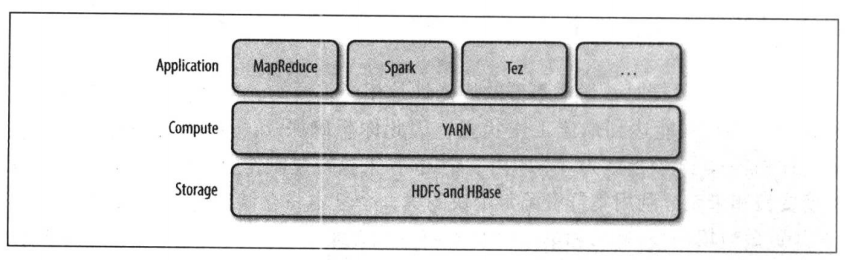
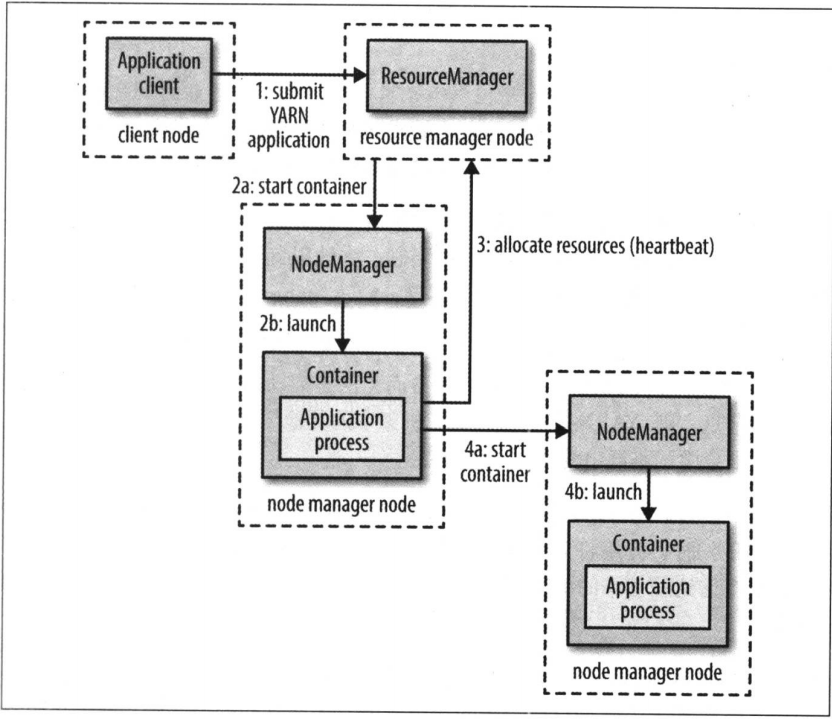

# 关于YARN

`Apache YARN (Yet Another Resource Negotiator)`是`Hadoop`的集群资源管理系统

最初是为了改善`MapReduce`的实现，但它肯人足够的通用性，同样可以支持其他分布式计算模式。

`YARN`提供请求和使用群资源的`API`，但这些`API`很少直接用户用户代码。相反，用户代码中用的是分布式计算框架提供的更高层`API`，这些`API`建立在`YARN`之上且向用户隐藏了资源管理细节。

- 运行机制

`YARN`通过两长期运行的守护进程提供自己的核心服务
- 管理集群上资源使用的资源管理器(`resource manager`)
- 运行在集群中所有节点上且能够启动和监控容器(`container`)的节点管理器(`node manager`)

容器用于执行特定应用程序的进程，每个容器都有资源限制（内存、CPU等）

- 应用生命周期

`YARN`应用的生命期差异性非常大， 有几秒的短期应用，也有连续运行几天甚至几个月的长期应用
。
与其关注应用运行多长时间，不如按照应用到用户运行的作业之间的映射关系对应应用进行分类更有意义。

最简单的模型是一个用户作业对 应一个应用，这也是`MapReduce`采取的方式。

第二种模型是， 作业的每个工作流或每个用户对话（可能并无关联性）对应一个应用。这种方法要比第一种情况效率更高，因为窗口可以在作业 之间重用，并且有可能缓存作业之间的中间数据。 `Spark`采取的是这种模型。

第三种模型是，多个用户共享一个长期运行的应用。这种用通常是作为一种协调者的角色在运行。 例如：`Apache Slider`有一个长期运行的`application master`，主要用于启动集群上的其他应用。

`Impala`也是使用这种模型提供了一个代理应用， `Impala`守护进程通过该代理请求集群资源。由于避免了启动新`application master`带来的开销，一个总是开启(`always on`)的`application master`意味着用户将获得非常低延迟的查询响应。
