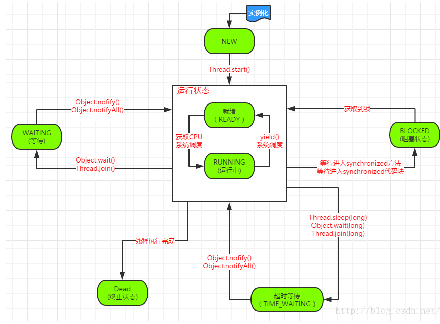

# java enum类 - Thread#State 线程状态

- `NEW` 线程刚被创建，但是没有启动时
    > new Thread()
- `RUNABLE` 正在JVM中运行，但是可能正在等待操作系统的其他资源
    > Thread.start

- `BLOCKED` 线程等待进入临界区（`Monitor`锁），
    > 多个线程存在同步操作，如正在等待另一个线程的synchronized块的执行释放，或者可重入的synchronized块里调用wait()方法

- `WAITING` 处于等待状态的线程，正在等待另一个线程执行特定的操作
    >没有超时设置的Object.wait
    >
    >没有超时设置的Thread.join
    >
    >LockSupport.park

- `TIMED_WAITING` 限定时间的`WAITING`
    > Thread.sleep
    >
    > 带超时时间设置的Object.wait
    >
    > 带超时时间设置的Thread.join
    >
    > LockSupport.parkNanos
    >
    > LockSuuport.parkUntil
- `TERMINATED` 线程结果
    > 线程执行完毕
    >
    > 线程执行异常结束

图中的方法解析如下：([From CSDN](https://blog.csdn.net/javazejian/article/details/50878598))

  - Thread.sleep()：在指定时间内让当前正在执行的线程暂停执行，但不会释放"锁标志"。不推荐使用。
  - Thread.sleep(long)：使当前线程进入阻塞状态，在指定时间内不会执行。 
  - Object.wait()和Object.wait(long)：在其他线程调用对象的notify或notifyAll方法前，导致当前线程等待。线程会释放掉它所占有的"锁标志"，从而使别的线程有机会抢占该锁。 当前线程必须拥有当前对象锁。如果当前线程不是此锁的拥有者，会抛出IllegalMonitorStateException异常。 唤醒当前对象锁的等待线程使用notify或notifyAll方法，也必须拥有相同的对象锁，否则也会抛出IllegalMonitorStateException异常，waite()和notify()必须在synchronized函数或synchronized中进行调用。如果在non-synchronized函数或non-synchronized中进行调用,虽然能编译通过，但在运行时会发生IllegalMonitorStateException的异常。 
  - Object.notifyAll()：则从对象等待池中唤醒所有等待等待线程
  - Object.notify()：则从对象等待池中唤醒其中一个线程。
  - Thread.yield()方法 暂停当前正在执行的线程对象，yield()只是使当前线程重新回到可执行状态，所以执行yield()的线程有可能在进入到可执行状态后马上又被执行，yield()只能使同优先级或更高优先级的线程有执行的机会。 
  - Thread.Join()：把指定的线程加入到当前线程，可以将两个交替执行的线程合并为顺序执行的线程。比如在线程B中调用了线程A的Join()方法，直到线程A执行完毕后，才会继续执行线程B。
