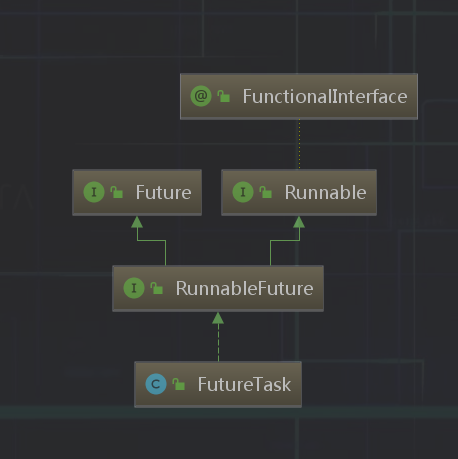
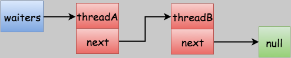
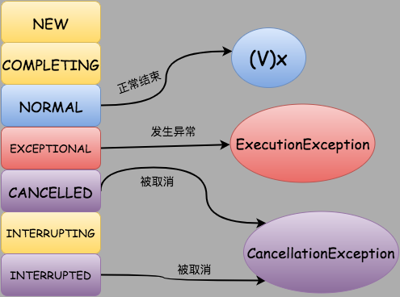

# java类 - FutureTask解析(基于jdk1.8)

在`java`中一般通过继承`Thread`类或者`Runnable`接口这两种方式来创建多线程，但是这两种方式都有个缺陷，就是不能在执行完成后获取执行的结果， 因为`java 1.5`之后提供了`Callable`和`Future`接口，通过它们就可以在任务执行完成之后得到任务的执行结果。[使用示例](./FutureTask.usage.md)

- `Callable`接口

```java
    @FunctionalInterface
    public interface Callable<V> {
        /**
         * Computes a result, or throws an exception if unable to do so.
         *
         * @return computed result
         * @throws Exception if unable to compute a result
         */
        V call() throws Exception;
    }
```
`Callable`是个泛型接口，`V`表示`call()`方法要返回的类型。

`Callable`接口和`Runnable`接口相似，都可以被另一个线程执行。 但是`Runable`不会返回数据也不能抛出异常。

---

- `Future`

`Future`表示异步计算的结果。提供方法以检查计算是否完成，等待完成，以及检索计算结果。
```java
    public interface Future<V> {
        /**
         * 用来取消息异步任务的执行
         * 如果异步任务已经完成或者已经被取消，或者由于某些原因不能取消，返回false
         * 如果任务还没有执行，则返回true并且不会执行任务
         * 如果任务已经开始执行，参数mayInterruptIfRunning如果为true，则不管是否任务执行完成，都会立即中断纯种并返回true
         * 如果参数mayInterruptIfRuning为false，则会返回true，但不会中断执行线程
         * 调用该方法之后，如果返回true则 {@link #isDone}和 {@link #isCancelled}都会返回true
         **/
        boolean cancle(boolean mayInterruptIfRuning);
        /**
         * 判断任务是否被取消
         * 如果任务完成之前被取消，即调用了 {@link #cancle}方法，则返回true         
         **/
        boolean isCancelled();
        /**
         * 判断任务是否已经完成，如果完成则返回true
         * 需要注意的是， 如果执行过种中有异常、取消都返回true，如{@link cancle}被调用，则该方法返回true
         **/
        boolean isDone();
        /**
         * 等待任务完成，获取任务执行结果
         * 如果等待时，任务被取消，则会抛出CancellationException异常
         * 如果执行时出现异常，则会抛出ExecutionException异常
         * 如果执行时任务被中断，则会抛出InterruptedException异常
         **/
        V get() throws InterruptedException, ExecutionException;
        /**
         * 带超时时间的get()方法
         * 如果等待过程中超时，抛出TimeoutException异常
         **/
        V get(long timeout, TimeUnit unit)
        throws InterruptedException, ExecutionException, TimeoutException;
    }
```

---

- FutureTask

`FutureTask`是`Future`的具体实现类



 1. 状态参数说明

```java
    /**
     * The run state of this task, initially NEW.  The run state
     * transitions to a terminal state only in methods set,
     * setException, and cancel.  During completion, state may take on
     * transient values of COMPLETING (while outcome is being set) or
     * INTERRUPTING (only while interrupting the runner to satisfy a
     * cancel(true)). Transitions from these intermediate to final
     * states use cheaper ordered/lazy writes because values are unique
     * and cannot be further modified.
     *
     * Possible state transitions:
     * NEW -> COMPLETING -> NORMAL
     * NEW -> COMPLETING -> EXCEPTIONAL
     * NEW -> CANCELLED
     * NEW -> INTERRUPTING -> INTERRUPTED
     */
    private volatile int state;
    //初始状态，表示是个新的任务，或者还没有被执行完的任务
    private static final int NEW          = 0;
    //中间状态， 任务已经执行完成，或者执行时发生异常，但是任务执行结果或者异常原因还没有保存到outcome中
    private static final int COMPLETING   = 1;
    //最终状态， 任务已经执行完成且执行结果已保存到outcome中
    private static final int NORMAL       = 2;
    //最终状态， 任务发生异常，且异常原因已经保存到outcome中
    private static final int EXCEPTIONAL  = 3;
    //最终状态， 任务还没开始执行或者已经开始执行但是还没有执行完成时，调用 #cancle(fase)方法取消任务且不中断任务执行线程
    private static final int CANCELLED    = 4;
    //中间状态， 任务还没开始执行或者已经开始执行但是还没有执行完成时，调用 #cancle(true)方法取消任务且要中断任务执行线程，但是还没中断线程时
    private static final int INTERRUPTING = 5;
    //最终状态， 调用interrupt()中断任务执行线程之后
    private static final int INTERRUPTED  = 6;
```
需要`注意`的是，所有状态值如果 > `COMPLETING` 都表示任务已经执行`完成`

 2. 构造函数

```java
    /**
     * Creates a {@code FutureTask} that will, upon running, execute the
     * given {@code Callable}.
     *
     * @param  callable the callable task
     * @throws NullPointerException if the callable is null
     */
    public FutureTask(Callable<V> callable) {
        if (callable == null)
            throw new NullPointerException();
        // callable 变量
        this.callable = callable;
        // 初始化执行状态为 NEW
        this.state = NEW;       // ensure visibility of callable
    }


    /**
    * Creates a {@code FutureTask} that will, upon running, execute the
    * given {@code Runnable}, and arrange that {@code get} will return the
    * given result on successful completion.
    *
    * @param runnable the runnable task
    * @param result the result to return on successful completion. If
    * you don't need a particular result, consider using
    * constructions of the form:
    * {@code Future<?> f = new FutureTask<Void>(runnable, null)}
    * @throws NullPointerException if the runnable is null
    */
   public FutureTask(Runnable runnable, V result) {
       //将runable转换成 callable
       this.callable = Executors.callable(runnable, result);
       // 初始化执行状态为 NEW
       this.state = NEW;       // ensure visibility of callable
   }
```
[`Executors.callable`方法](./Executors.md)用来转换`runable`为`callable`

 3. run() 开始执行任务

```java
    public void run() {
        //1. 状态是否为NEW，如果不是，则任务已经被执行或，或者被取消
        //2. 状态为NEW,尝试将当前执行线程保存到runner中
        if (state != NEW ||
            !UNSAFE.compareAndSwapObject(this, runnerOffset,
                                         null, Thread.currentThread()))
            return;
        try {
            Callable<V> c = callable;
            if (c != null && state == NEW) {
                V result;
                boolean ran;
                try {
                    //  执行任务
                    result = c.call();
                    ran = true;
                } catch (Throwable ex) {
                    //任务异常
                    result = null;
                    ran = false;
                    //设置异常
                    setException(ex);
                }
                if (ran)
                    // 任务正常执行完成，设置结果
                    set(result);
            }
        } finally {
            // runner must be non-null until state is settled to
            // prevent concurrent calls to run()
            runner = null;
            // state must be re-read after nulling runner to prevent
            // leaked interrupts
            int s = state;
            //任务被中断， 执行中断处理
            if (s >= INTERRUPTING)
                handlePossibleCancellationInterrupt(s);
        }
    }
```

4. setException(Throwable t) 设置任务执行时异常

```java
    /**
     * Causes this future to report an {@link ExecutionException}
     * with the given throwable as its cause, unless this future has
     * already been set or has been cancelled.
     *
     * <p>This method is invoked internally by the {@link #run} method
     * upon failure of the computation.
     *
     * @param t the cause of failure
     */
    protected void setException(Throwable t) {
        // 将状态由 NEW -> COMPLETING
        if (UNSAFE.compareAndSwapInt(this, stateOffset, NEW, COMPLETING)) {
            // 保存失败原因到 outcome中
            outcome = t;
            //将状态由 COMPLETING -> EXCEPTIONAL
            UNSAFE.putOrderedInt(this, stateOffset, EXCEPTIONAL); // final state
            //完成任务
            finishCompletion();
        }
    }
```

5. set(V v) 设置任务执行结果

```java
    /**
     * Sets the result of this future to the given value unless
     * this future has already been set or has been cancelled.
     *
     * <p>This method is invoked internally by the {@link #run} method
     * upon successful completion of the computation.
     *
     * @param v the value
     */
    protected void set(V v) {
        // 将状态由 NEW-> COMPLETING
        if (UNSAFE.compareAndSwapInt(this, stateOffset, NEW, COMPLETING)) {
            // 将执行结果保存到 outcome中
            outcome = v;
            //状状态由 COMPLETING -> NORMAL
            UNSAFE.putOrderedInt(this, stateOffset, NORMAL); // final state
            //完成任务
            finishCompletion();
        }
    }
```

 6. get() 获取任务执行结果，如果还没有执行完成，等待执行完成

```java
    /**
    * @throws CancellationException {@inheritDoc}
    */
   public V get() throws InterruptedException, ExecutionException {
       int s = state;
       // 判断任务是否已经完成
       if (s <= COMPLETING)
           //任务未完成，进行阻塞等待
           s = awaitDone(false, 0L);
       //取得执行结果
       return report(s);
   }

   /**
    * @throws CancellationException {@inheritDoc}
    */
   public V get(long timeout, TimeUnit unit)
       throws InterruptedException, ExecutionException, TimeoutException {
       if (unit == null)
           throw new NullPointerException();
       int s = state;
       if (s <= COMPLETING &&
           (s = awaitDone(true, unit.toNanos(timeout))) <= COMPLETING)
           throw new TimeoutException();
       return report(s);
   }
```

 7. awaitDone(boolean timed, long nanos) 阻塞线程等待

```java
    /**
     * Awaits completion or aborts on interrupt or timeout.
     *
     * @param timed true if use timed waits
     * @param nanos time to wait, if timed
     * @return state upon completion
     */
    private int awaitDone(boolean timed, long nanos)
        throws InterruptedException {
        final long deadline = timed ? System.nanoTime() + nanos : 0L;
        WaitNode q = null;
        boolean queued = false;
        for (;;) {
            // 状态线程是否被设置为中断标识，如果是，则从等待队列中移除
            if (Thread.interrupted()) {
                removeWaiter(q);
                // 抛出中断异常
                throw new InterruptedException();
            }

            int s = state;
            // s > COMPLETING 都表示任务已经完成（可能是正常结果，或者异常、取消)
            if (s > COMPLETING) {
                if (q != null)
                    q.thread = null;
                //返回结果
                return s;
            }
            // 任务已经结束，但是任务线程还没有给 outcome 赋值， 此是该线程让出执行树，让其他线程优先执行
            else if (s == COMPLETING) // cannot time out yet
                Thread.yield();
            // 如果节点等待为空，则创建一个等待节点
            else if (q == null)
                q = new WaitNode();
            // 如果没有进入等待队列， 则将当前节点加入waiters首节点并替换原来的waiters
            else if (!queued)
                queued = UNSAFE.compareAndSwapObject(this, waitersOffset,
                                                     q.next = waiters, q);

            else if (timed) {
                // 设定了等待时间，则计算需要等待的时间，如果已经超时，则删除对应节点，并返回对应状态
                nanos = deadline - System.nanoTime();
                if (nanos <= 0L) {
                    removeWaiter(q);
                    return state;
                }
                // 阻塞等待特定时间
                LockSupport.parkNanos(this, nanos);
            }
            else
                // 阻塞等待，直接被其他线程唤醒k
                LockSupport.park(this);
        }
    }
```

假设当前`state=NEW`且`waiters`为`NULL`，也就是说，还没有任何一个线程调用`get()`获取执行结果，这个时候，有两个线程A和B先后调用`get()`来获取执行结果。

再假设， 这两个线程在加入阻塞队列进行阻塞等待之前任务都没有执行完成，且A和B都没有被中断（因为如果A和B在进行阻塞等待结果之前任务就执行完成或者线程本身被中断的话，`awaitDone()`就执行结束返回了）

执行过程如下：
    1. 第一次for:  q == null ，新建节点q >> end
    2. 第二次for:  !queue, 在第一次for中生成的节点的next=waiters,然后CAS把节点q替换waiters。也就是把新生成的节点添加到waiters链表的首节点， queue = 替换结果 >> end
    3. 第三次for: 进行阻塞等待，根据是否设定超时，阻塞特定时间或被其他线程唤醒
线程A和B都阻塞等待之后的waiters结果如下图：


 8. cancel(boolean) 取消任务

```java
    public boolean cancel(boolean mayInterruptIfRunning) {
        // 判断状态为NEW，并且如果需要中断任务，则变更状态 NEW -> INTERRUPTING
        // 如果不需要中断任务， 则将状态 NEW -> CANCELLED
        if (!(state == NEW &&
              UNSAFE.compareAndSwapInt(this, stateOffset, NEW,
                  mayInterruptIfRunning ? INTERRUPTING : CANCELLED)))
            return false;
        try {    // in case call to interrupt throws exception
            if (mayInterruptIfRunning) {
                try {
                    Thread t = runner;
                    if (t != null)
                        //中断执行任务
                        /**
                         * 注意， interrupt() 不会中断一个正在运行中的线程
                         * 只是设置线程状态为中断的状态
                         **/
                        t.interrupt();
                } finally { // final state
                    //状态状态为 INTERRUPTED
                    UNSAFE.putOrderedInt(this, stateOffset, INTERRUPTED);
                }
            }
        } finally {
            //完成任务
            finishCompletion();
        }
        return true;
    }
```

 9. finishCompletion() 删除并通知所有等待线程

```java
    /**
     * Removes and signals all waiting threads, invokes done(), and
     * nulls out callable.
     */
    private void finishCompletion() {
        // assert state > COMPLETING;
        //遍历 waiters链表，唤醒节点中的线程
        for (WaitNode q; (q = waiters) != null;) {
            if (UNSAFE.compareAndSwapObject(this, waitersOffset, q, null)) {
                for (;;) {
                    Thread t = q.thread;
                    if (t != null) {
                        q.thread = null;
                        LockSupport.unpark(t);
                    }
                    WaitNode next = q.next;
                    if (next == null)
                        break;
                    q.next = null; // unlink to help gc
                    q = next;
                }
                break;
            }
        }

        done();

        callable = null;        // to reduce footprint
    }
```

 10. report(int) 取得执行结果

```java
    /**
     * Returns result or throws exception for completed task.
     *
     * @param s completed state value
     */
    @SuppressWarnings("unchecked")
    private V report(int s) throws ExecutionException {
        // 状态状态，根据不同任务状态映射成任务执行结果
        Object x = outcome;
        // 任务正常完成
        if (s == NORMAL)
            return (V)x;
        // 任务被取消，抛出CancellationException
        if (s >= CANCELLED)
            throw new CancellationException();
        // 抛出执行时异常
        throw new ExecutionException((Throwable)x);
    }
```
映射关系如下图所示:



如果任务处于`NEW`、`COMPLETING`和`INTERRUPTING`这三种状态的时候是执行不到report()方法的，所以没必要对这三种状态进行转换。

- 总结
`FutureTask`实现还是比较笑意 的， 当用户实现`Callable()`接口定义好任务之后， 把任务交给其他线程进行执行。 `FutureTask`内部维护一个任务状态，任何操作都围绕着这个状态进行， 并随时更新任务状态。

任务发起者调用`get()`获取执行结果时，如果任务还没有执行完毕，则将自己放放阻塞队列中，然后阻塞等待。

当任务完成之后，任务线程会依次唤醒阻塞等待的线程。

调用`cancel(boolean)`取消任务时，也只是修改了状态。

当任务还在执行的时候用户调用`cancel(true)`方法能否真正让任务停止执行呢？
在前面的分析中我们直到，当调用`cancel(true)`方法的时候，实际执行还是`Thread.interrupt()`方法，而`interrupt()`方法只是设置中断标志位，如果被中断的线程处于`sleep()`、`wait()`或者`join()`逻辑中则会抛出`InterruptedException`异常。

因此结论是:cancel(true)并不一定能够停止正在执行的异步任务。
