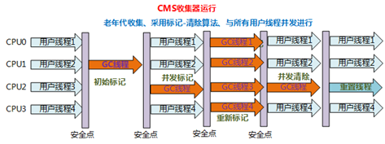
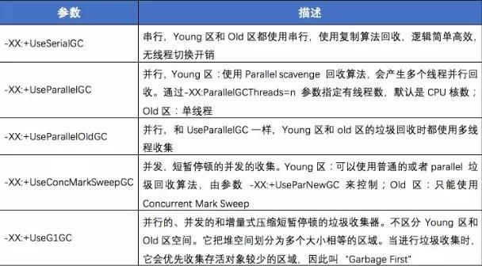
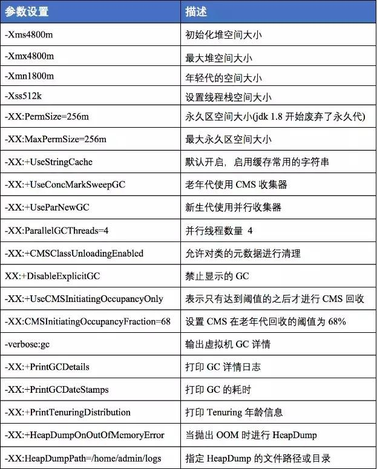

# GC类型介绍
> JDK1.8

## GC收集器介绍
## 类型
- <a href="#serial">serial收集器</a>
- <a href="#ParNew">parnew收集器</a>
- <a href="#ParallelScavenge">parallel scavenge收集器</a>
- <a href="#SerialOld">serial old 收集器</a>
- <a href="#ParallelOld">parallel old 收集器</a>
- <a href="#cms">cms 收集器</a>
- <a href="#g1">g1 收集器</a>


两个收集器之间存在连线，则说明它们可以搭配使用。虚拟机所处的区域则表示它是属于新生代还是老年代收集器

## 相关概念
`并行收集`：指多条垃圾收集线程并行工作，但此时用户线程仍处于等待状态。

`并发收集`：指用户线程与垃圾收集线程同时工作（不一定是并行的可能会交替执行）。用户程序在继续运行，而垃圾收集程序运行在另一个CPU上。

`吞吐量`：即CPU用于运行用户代码的时间与CPU总消耗时间的比值（吞吐量 = 运行用户代码时间 / ( 运行用户代码时间 + 垃圾收集时间 )）。例如：虚拟机共运行100分钟，垃圾收集器花掉1分钟，那么吞吐量就是99%

### <a name="serial">serial收集器</a>
Serial收集器是最基本的、发展历史最悠久的收集器。

特点：单线程、简单高效（与其他收集器的单线程相比），对于限定单个CPU的环境来说，Serial收集器由于没有线程交互的开销，专心做垃圾收集自然可以获得最高的单线程手机效率。收集器进行垃圾回收时，必须暂停其他所有的工作线程，直到它结束（Stop The World）。

应用场景：适用于Client模式下的虚拟机。

Serial / Serial Old收集器运行示意图


### <a name="ParNew">ParNew收集器</a>
ParNew收集器其实就是Serial收集器的多线程版本。

`除了使用多线程外其余行为均和Serial收集器一模一样（参数控制、收集算法、Stop The World、对象分配规则、回收策略等）。`

特点：多线程、ParNew收集器默认开启的收集线程数与CPU的数量相同，在CPU非常多的环境中，可以使用-XX:ParallelGCThreads参数来限制垃圾收集的线程数。

`和Serial收集器一样存在Stop The World问题`

应用场景：ParNew收集器是许多运行在Server模式下的虚拟机中首选的新生代收集器，因为它是除了Serial收集器外，唯一一个能与CMS收集器配合工作的。

ParNew/Serial Old组合收集器运行示意图如下：


### <a name="ParallelScavenge">Parallel Scavenge 收集器</a>

与吞吐量关系密切，故也称为吞吐量优先收集器。

特点：属于`新生代收集器`也是采用`复制算法`的收集器，又是并行的多线程收集器（与ParNew收集器类似）。

该收集器的目标是达到一个可控制的吞吐量。还有一个值得关注的点是：GC自适应调节策略（与ParNew收集器最重要的一个区别）

GC自适应调节策略：Parallel Scavenge收集器可设置-XX:+UseAdptiveSizePolicy参数。当开关打开时不需要手动指定新生代的大小（-Xmn）、Eden与Survivor区的比例（-XX:SurvivorRation）、晋升老年代的对象年龄（-XX:PretenureSizeThreshold）等，虚拟机会根据系统的运行状况收集性能监控信息，动态设置这些参数以提供最优的停顿时间和最高的吞吐量，这种调节方式称为GC的自适应调节策略。

Parallel Scavenge收集器使用两个参数控制吞吐量：

 - XX:MaxGCPauseMillis 控制最大的垃圾收集停顿时间
 - XX:GCRatio 直接设置吞吐量的大小。

### <a name="SerialOld">Serial Old 收集器</a>

Serial Old是Serial收集器的老年代版本。

特点：同样是单线程收集器，采用`标记-整理`算法。

应用场景：主要也是使用在Client模式下的虚拟机中。也可在Server模式下使用。

Server模式下主要的两大用途（在后续中详细讲解···）：

在JDK1.5以及以前的版本中与Parallel Scavenge收集器搭配使用。
作为CMS收集器的后备方案，在并发收集Concurent Mode Failure时使用。

Serial / Serial Old收集器工作过程图（Serial收集器图示相同）：


### <a name="ParallelOld">Parallel Old 收集器</a>

是Parallel Scavenge收集器的老年代版本。

特点：多线程，采用标记-整理算法。

应用场景：注重高吞吐量以及CPU资源敏感的场合，都可以优先考虑Parallel Scavenge+Parallel Old 收集器。

Parallel Scavenge/Parallel Old收集器工作过程图：


### <a name="cms">CMS收集器</a>
一种以获取最短回收停顿时间为目标的收集器。

特点：基于标记-清除算法实现。并发收集、低停顿。

应用场景：适用于注重服务的响应速度，希望系统停顿时间最短，给用户带来更好的体验等场景下。如web程序、b/s服务。

CMS收集器的运行过程分为下列4步：

`初始标记`：标记GC Roots能直接到的对象。速度很快但是仍存在Stop The World问题。

`并发标记`：进行GC Roots Tracing 的过程，找出存活对象且用户线程可并发执行。

`重新标记`：为了修正并发标记期间因用户程序继续运行而导致标记产生变动的那一部分对象的标记记录。仍然存在Stop The World问题。

`并发清除`：对标记的对象进行清除回收。

`CMS收集器的内存回收过程是与用户线程一起并发执行的。`

CMS收集器的工作过程图：



CMS收集器的缺点：
 - 对CPU资源非常敏感。
 - 无法处理浮动垃圾，可能出现Concurrent Model Failure失败而导致另一次Full GC的产生。
 - 因为采用标记-清除算法所以会存在空间碎片的问题，导致大对象无法分配空间，不得不提前触发一次Full GC。

### <a name="g1">G1收集器</a>

一款面向服务端应用的垃圾收集器。

特点如下：

`并行与并发`：G1能充分利用多CPU、多核环境下的硬件优势，使用多个CPU来缩短Stop-The-World停顿时间。部分收集器原本需要停顿Java线程来执行GC动作，G1收集器仍然可以通过并发的方式让Java程序继续运行。

`分代收集`：G1能够独自管理整个Java堆，并且采用不同的方式去处理新创建的对象和已经存活了一段时间、熬过多次GC的旧对象以获取更好的收集效果。

`空间整合`：G1运作期间不会产生空间碎片，收集后能提供规整的可用内存。

`可预测的停顿`：G1除了追求低停顿外，还能建立可预测的停顿时间模型。能让使用者明确指定在一个长度为M毫秒的时间段内，消耗在垃圾收集上的时间不得超过N毫秒。

##### G1为什么能建立可预测的停顿时间模型？

因为它有计划的避免在整个Java堆中进行全区域的垃圾收集。G1跟踪各个Region里面的垃圾堆积的大小，在后台维护一个优先列表，每次根据允许的收集时间，优先回收价值最大的Region。这样就保证了在有限的时间内可以获取尽可能高的收集效率。

##### G1与其他收集器的区别：

其他收集器的工作范围是整个新生代或者老年代、G1收集器的工作范围是整个Java堆。在使用G1收集器时，它将整个Java堆划分为多个大小相等的独立区域（Region）。虽然也保留了新生代、老年代的概念，但新生代和老年代不再是相互隔离的，他们都是一部分Region（不需要连续）的集合。

##### G1收集器存在的问题：

Region不可能是孤立的，分配在Region中的对象可以与Java堆中的任意对象发生引用关系。在采用可达性分析算法来判断对象是否存活时，得扫描整个Java堆才能保证准确性。其他收集器也存在这种问题（G1更加突出而已）。会导致Minor GC效率下降。

##### G1收集器是如何解决上述问题的？

采用Remembered Set来避免整堆扫描。G1中每个Region都有一个与之对应的Remembered Set，虚拟机发现程序在对Reference类型进行写操作时，会产生一个Write Barrier暂时中断写操作，检查Reference引用对象是否处于多个Region中（即检查老年代中是否引用了新生代中的对象），如果是，便通过CardTable把相关引用信息记录到被引用对象所属的Region的Remembered Set中。当进行内存回收时，在GC根节点的枚举范围中加入Remembered Set即可保证不对全堆进行扫描也不会有遗漏。

如果不计算维护 Remembered Set 的操作，G1收集器大致可分为如下步骤：

`初始标记`：仅标记GC Roots能直接到的对象，并且修改TAMS（Next Top at Mark Start）的值，让下一阶段用户程序并发运行时，能在正确可用的Region中创建新对象。（需要线程停顿，但耗时很短。）

`并发标记`：从GC Roots开始对堆中对象进行可达性分析，找出存活对象。（耗时较长，但可与用户程序并发执行）

`最终标记`：为了修正在并发标记期间因用户程序执行而导致标记产生变化的那一部分标记记录。且对象的变化记录在线程Remembered Set  Logs里面，把Remembered Set  Logs里面的数据合并到Remembered Set中。（需要线程停顿，但可并行执行。）

`筛选回收`：对各个Region的回收价值和成本进行排序，根据用户所期望的GC停顿时间来制定回收计划。（可并发执行）

G1收集器运行示意图：


## 默认GC器
- jps 查看进程ID
- jinfo -flags {pid} 查看所有参数

可以得到如下部份信息：
```
Non-default VM flags:
-XX:CICompilerCount=2 -XX:InitialHeapSize=65011712 -XX:MaxHeapSize=1035993088
-XX:MaxNewSize=344981504 -XX:MinHeapDeltaBytes=524288 -XX:NewSize=21495808
-XX:OldSize=43515904 -XX:+UseCompressedClassPointers -XX:+UseCompressedOops
-XX:+UseFastUnorderedTimeStamps -XX:+UseParallelGC
```

可以看到，`JDK8`默认使用的参数为`-XX:+UseParallelGC`

也就是新生代中采用`Parallel scavenge`回收算法（多线程并行回收），老年代使用`parallel old`进行回收。

## 回收器参数



如上表所示，目前主要有串行、并行和并发三种，对于大内存的应用而言，串行的性能太低，因此使用到的主要是并行和并发两种。

并行和并发 GC 的策略通过 `UseParallelGC` 和 `UseConcMarkSweepGC` 来指定，还有一些细节的配置参数用来配置策略的执行方式。例如：`XX:ParallelGCThreads`， `XX:CMSInitiatingOccupancyFraction` 等。 通常：`Young` 区对象回收只可选择并行（耗时间），Old 区选择并发（耗 CPU）

## 项目中常用配置


## 常用组合

