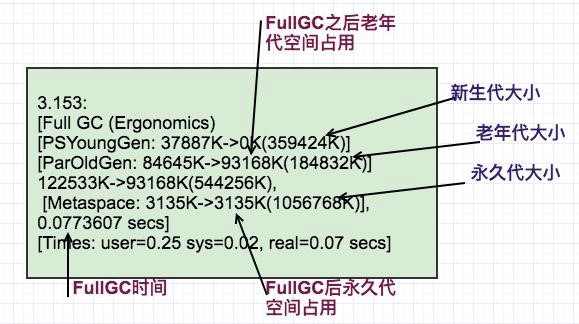
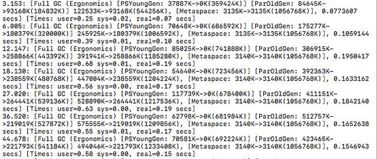

# JVM GC调优
> JDK1.8  
> [GC类型介绍](./GC类型介绍.md)

## GC调优的合理规划
### GC性能的定义
在针对JVM进行性能调优时，首先需要了解JVM性能调优时对性能的定义与目标。
- 吞吐量： 在不考虑GC引起的停顿时间或内存消耗，GC能支撑应用达到的最高性能指标。
- 延迟：减少或完全清除（0GC）因为GC引起的停顿时间
- 内存占用： GC流畅运行时需要的内存大小

### GC类型
- MinorGC 清除年轻区
- MajorGC 清除永久代
- FullGC  清理整个堆空间

### 调优原则
在对JVM进行性能优化时，吞吐量、延迟、内存占用三者在其中任何一个得到优化时，几乎都是以另一个或者另二个的性能损失做为代价的，无法兼得。

至于在优化时的选择上，要优化哪个选项，需要根据业务需求来确定。

- 避免`FullGC`原则： 最大可能的在`MinorGC`时清除尽可能多的对象，降低`FullGC`频率
- GC内存最大化原则：处理吞吐量和延迟问题时候，垃圾处理器能使用的内存越大，垃圾收集的效果越好，应用程序也会越来越流畅。
- GC调优3选2原则：在吞吐量、延迟、内存占用只能选择2个进行优化，不可三者兼得。


### 必要性
从系统的各个角度和层次思考，性能调优分为
- 架构调优
- 代码调优
- JVM调优
- 数据库调优
- 操作系统调优

所以，在调优阶段是需要从多个方面考虑的，在`正常情况下，多数的JAVA应用是不需要进行GC优化的`。

JVM在应用之前，首先已经经过了参数优化。大多数导致频繁GC的问题，基本上不是因为参数设置问题，而是代码质量引起的。

GC调优涉及到方方面面的取舍，牵一发而动全身，需要全盘考虑各方面的影响。所以，#`GC调优应该是最后的采用手段，而不是为了调优而调优`#。

如果满足以下指标，则一般不需要进到GC优化：
- MinorGC 执行时间不到50ms；
- Minor GC 执行不频繁，约10秒一次；
- Full GC 执行时间不到1s；
- Full GC 执行频率不算频繁，不低于10分钟1次。


## GC调优
### 调优的基本流程
根据性能测试结果不断优化配置而多次迭代
- <a href="#memory">优先满足程序的内存需求</a>
- <a href="#delay">调整GC时间延迟需求</a>
- <a href="#throughput">吞吐量需求</a>


#### <a name="memory">内存调优</a>
程序的内在占用以及活跃数据大小，应该是在程序的稳定阶段确定的，而不是在初始阶段。
###### 应用运行阶段
- 初始化阶段：JVM加载应用程序，初始化应用程序的主要模块和数据
- 稳定阶段：应用程序执行较多时间，经历过压力测试之后，各项性能参数呈稳定状态，核心函数被执行，已经JIT编译预热。

###### 堆主要组成与调优

JVM堆中，内存主要空间由新生代、老生代和永久代组成。


GC调优的目的就是将转移到老生代的对象数据降低，减少GC执行时间。

先来看下JVM的命令参数：  
|分代参数|描述|
|--|--|
|-Xms|`堆`初始大小，默认为物理内存的1/64（<1GB）|
|-Xmx|`堆`最大大小，默认如果空余堆大小大于70%（MaxHeapFreeRatio可以修改大小）时，JVM会自动减少堆直到-Xms的最小限制|
|-XX:NewSize|`新生代`空间初始大小|
|-XX:MaxNewSize|`新生代`空间最大大小|
|-Xmn|新生代空间大小（eden + 2 survivor space)|
|-XX:PermSize|`永久代`初始大小`和最小值`|
|-XX:MaxPermSize|`永久代`最大大小|

注意，老年代的大小会根据`新生代`自动设定：
`老年代初始大小`=`堆`最大大小(-Xmx) `减` 新生代初始大小(-XX:NewSize)

`老年代最大大小` = `堆`最大大小(-Xmx) `减` 新生代最大大小(-XX:MaxNewSize)

从参数配置来看，在设置的时候，应该尽量的将堆`-Xms`与`-Xmx`设置大小一置，避免`JVM`一直扩容、缩容。

同时，也应该尽量将永久代`-XX:PerSize`与`-XX:MaxPermSize`设置大小一置，因为永久代的大小调整需要进行`FullGC`才能实现。


###### <a name="ActiveData">老年代空间的活跃数据</a>
- 稳定阶段
    一定得需要产生足够的压力，找到应用程序和生产环境高峰符合状态类似的负荷，在此之后达到峰值之后，保持一个稳定的状态，才算是一个稳定阶段。所以，要达到稳定阶段，`必须经过压力测试`。

- 活跃数据大小计算
    - 采用默认JVM参数
    - FullGC数据在应用稳定运行阶段

> GC日志指令： `-XX:+PrintGCTimeStamps -XX:+PrintGCDetails -Xloggc:<filename>`
>
> GC日志对性能的影响极小，在生产环境也可以开启
>
> 触发条件： 1、自动 2、监控工具强制调用 3、jmap -histo:live pid

在稳定阶段触发`FullGC`一般可以拿到如下信息：

从以上gc日志中，我们大概可以分析到，在发生fullGC之时，整个应用的堆占用以及GC时间，当然了，为了更加精确，应该多收集几次，获取一个平均值。或者是采用耗时最长的一次FullGC来进行估算。

在上图中，fullGC之后，老年代空间占用在93168kb（约93MB），我们以此定为`老年代空间的活跃数据`。

分配规则
|--|--|--|
|空间|命令参数|建议扩大倍数|
|堆|-Xms和-Xmx|3-4位FullGC后的老年代空间占用|
|永久代|-XX:PerSize和-XX:MaxPermSize|1.2-1.5倍FullGC后的永久代空间占用|
|新生代|-Xmn|1-1.5倍FullGC之后的老年代空间占用|
|老年代||2-3倍FullGC后的老年代空间占用|

基于以上规则和上图中的FullGC信息，我们现在可以规划的该应用堆空间为：
```
java 堆空间: 373Mb (=老年代空间93168kb*4)
新生代空间:140Mb(=老年代空间93168kb*1.5)
永久代空间:5Mb(=永久代空间3135kb*1.5)
老年代空间: 233Mb=堆空间-新生代看空间=373Mb-140Mb
```
对应的应用启动参数应该为:

`java -Xms373m -Xmx373m -Xmn140m -XX:PermSize=5m -XX:MaxPermSize=5m`


#### <a name="delay">延迟调优</a>
##### 调优指标
- 应用程序可接受的平均停滞时间: 此时间与测量的Minor GC持续时间进行比较。
- 可接受的Minor GC频率：Minor GC的频率与可容忍的值进行比较。
- 可接受的最大停顿时间: 最大停顿时间与最差情况下FullGC的持续时间进行比较。
- 可接受的最大停顿发生的频率：基本就是FullGC的频率。

以上中，平均停滞时间和最大停顿时间，对用户体验最为重要，可以多关注。

##### 优化新生代大小


比如如上的gc日志中，我们可以看到`MinorGC`的`平均持续时间`为0.069秒，MinorGC 的`平均频率`为0.389秒一次。

###### 如何降低新生代GC时间
新生代空间越大，则`MinorGC时间越长，频率越低`，如果想降低`时间`，则需要减少空间（频率增加）， 如果想降低`频率`，则需要增加空间（时间增加）。

同时，在修改新生代时，应该`尽量保持老年代的大小`，降低对其他区域的影响。

如日志中的`GC时间`较长，可以尝试减小空间大小，如`降低10%`。

第一次调优参数：
`java -Xms373m -Xmx373m -Xmn126m -XX:PermSize=5m -XX:MaxPermSize=5m`

> 由-Xmn140m降低10%变为-Xmn126m

##### 优化老年代大小
> 在优化完`新生代大小`之后，需要重新对应用进行压测，等待稳定之后重新采集GC日志

老年代的优化主要关注FullGC的持续时间和频率



从上面的日志信息中，可以计算出`FullGC`的`平均持续时间`为0.14秒，`平均频率`为5.8秒。（以上为了测试，真实中FullmGC不会这么快）

调优过程跟优化新年代大小基本一致，主要是根据<a href="ActiveData">活动数据大小</a>进行微调， 更主要的目的是降低`频率`。

如果`FullGC`时间无法满足要求，就需要切换`垃圾回收机制`进行另外的优化。

###### 根据`MinorGC`对象提升率计算`FullGC`数据
> 如果没有FullGC日志的情况下可以采用该方法

比如上述中启动参数中，我们的老年代大小=233Mb。

那么需要多久才能填满老年代中这233Mb的空闲空间取决于新生代到老年代的提升率。

```
每次提升老年代占用量=每次MinorGC 之后 java堆占用情况 减去 MinorGC后新生代的空间占用  
对象提升率=平均值（每次提升老年代占用量) 除以 老年代空间
```

有了对象提升率，我们就可以算出填充满老年代空间需要多少次minorGC，大概一次fullGC的时间就可以计算出来了。

比如:


上图中:

```
第一次minor GC 之后，老年代空间:13740kb - 13732kb =8kb
第二次minor GC 之后，老年代空间:22394kb - 17905kb =4489kb
第三次minor GC 之后，老年代空间:34739kb - 17917kb =16822kb
第四次minor GC 之后，老年代空间:48143kb - 17913kb =30230kb
第五次minor GC 之后，老年代空间:62112kb - 17917kb =44195kb
```
老年代每次minorGC提升率
```
4481kb 第二次和第一次minorGC之间
12333kb 第3次和第2次minorGC之间
13408kb 第4次和第3次minorGC之间
13965kb 第5次和第4次minorGC之间
```
我们可以测算出：
```
每次minorGC 的平均提升为12211kb,约为12Mb
上图中，平均minorGC的频率为 213ms/次
提升率=12211kb/213ms=57kb/ms
老年代空间233Mb ,占满大概需要233*1024/57=4185ms 约为4.185s。
```
FullGC的预期最差频率时长可以通过以上两种方式估算出来，可以调整老年代的大小来调整`FullGC的频率`，当然了，如果`FullGC持续时间过长`，无法达到应用程序的最差延迟要求，`就需要切换垃圾处理器`了。

#### <a name="throughput">吞吐量调优</a>
> 即CPU用于运行用户代码的时间与CPU总消耗时间的比值（吞吐量 = 运行用户代码时间 / ( 运行用户代码时间 + 垃圾收集时间 )）。例如：虚拟机共运行100分钟，垃圾收集器花掉1分钟，那么吞吐量就是99%

经过上述漫长 调优过程，最终来到了调优的最后一步，这一步对上述的结果进行吞吐量测试，并进行微调。

吞吐量调优主要是基于应用程序的吞吐量要求而来的，应用程序应该有一个综合的吞吐指标，这个指标基于真个应用的需求和测试而衍生出来的。当有应用程序的吞吐量达到或者超过预期的吞吐目标，整个调优过程就可以圆满结束了。

如果出现调优后依然无法达到应用程序的吞吐目标，需要重新回顾吞吐要求，评估当前吞吐量和目标差距是否巨大，如果在20%左右，可以修改参数，加大内存，再次从头调试，如果巨大就需要从整个应用层面来考虑，设计以及目标是否一致了，重新评估吞吐目标。

对于垃圾收集器来说，提升吞吐量的性能调优的目标就是就是尽可能避免或者很少发生FullGC 或者Stop-The-World压缩式垃圾收集（CMS），因为这两种方式都会造成应用程序吞吐降低。尽量在MinorGC 阶段回收更多的对象，避免对象提升过快到老年代。
