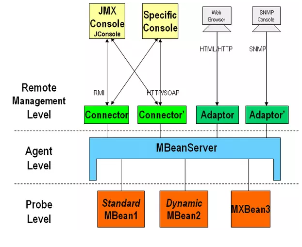

# JMX

> 所谓JMX，是Java Management Extensions(Java管理扩展)的缩写，是一个为应用程序植入管理功能的框架。用户可以在任何Java应用程序中使用这些代理和服务实现管理。


- 构架图

  

- MBean

 |类型|描述|
 |--|--|
 |standard MBean|这种类型的MBean最简单，它能管理的资源（包括属性，方法，时间）必须定义在接口中，然后MBean必须实现这个接口。它的命名也必须遵循一定的规范，例如我们的MBean为Hello，则接口必须为HelloMBean。|
 |dynamic MBean|必须实现javax.management.DynamicMBean接口，所有的属性，方法都在运行时定义|
 |model MBean|与标准和动态MBean相比，你可以不用写MBean类，只需使用javax.management.modelmbean.RequiredModelMBean即可。RequiredModelMBean实现了ModelMBean接口，而ModelMBean扩展了DynamicMBean接口，因此与DynamicMBean相似，Model MBean的管理资源也是在运行时定义的。与DynamicMBean不同的是，DynamicMBean管理的资源一般定义在DynamicMBean中（运行时才决定管理那些资源），而model MBean管理的资源并不在MBean中，而是在外部（通常是一个类），只有在运行时，才通过set方法将其加入到model MBean中。|


- 适配层：MbeanServer，提供对资源的注册和管理
- 接入层： 提供远程访问的入口

- 代码示例：
  - 创建MBean

    ```java
    public interface HelloMBean {
        //示例： 定义一个MBean。
        //MBean的规范必须是以实现类的类名+MBean，如：HelloMBean其实现类必须为Hello
        void sayHai();
    }
    public class Hello implements HelloMBean {
        @Override
        public void sayHai() {
            System.out.println("hai");
        }
    }
    ```
  - 注册

    ```java
    MBeanServer beanServer = ManagementFactory.getPlatformMBeanServer();
    Hello hello = new Hello();
    beanServer.registerMBean(hello, new ObjectName("jmxBean:name=Hello"));
    ```
  - MBean通知MBean

    ```java
    public interface AllNotificationerMBean {
      void doSay();
    }
    public class AllNotificationer extends NotificationBroadcasterSupport
                                implements AllNotificationerMBean {

    @Override
    public void doSay() {
        Notification notification = new Notification("doSay", this, 0);
        super.sendNotification(notification);
      }
    }
    //注册
    AllNotificationer allNotificationer = new AllNotificationer();
            beanServer.registerMBean(allNotificationer,
            new ObjectName("jmxBean:name=AllNotificationer"));
    //通知监听
    allNotificationer.addNotificationListener(
                            (notification, handback) -> System.out.println(handback),
                            null, hello);
    ```
