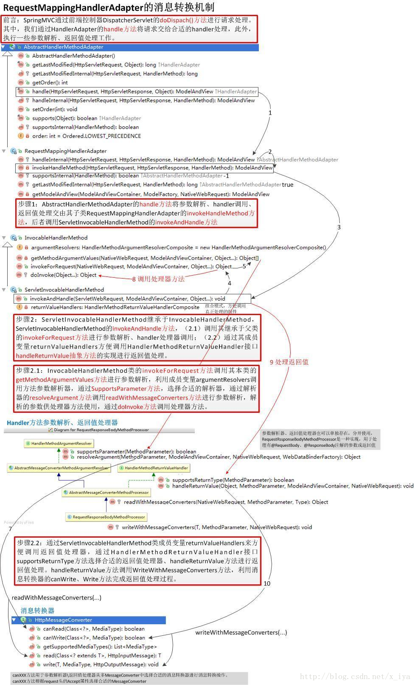

# ResponseBody 解析

SpringMvc在方法返回值的序列化方式：
- `ModelAndView` （默认）
- `@ResponseBody`

`@ResponseBody`处理器：
`org.springframework.web.servlet.mvc.method.annotation.RequestResponseBodyMethodProcessor`


`RequestResponseBodyMethodProcessor`:
说明：解析注解`@RequestBody`的方法请求参数或者方法的处理结果，使用
HttpMessageConverter来读或者写。

方法处理结果方法`#handlerReturnValue`：
```java
@Override
public void handleReturnValue(@Nullable Object returnValue, MethodParameter returnType,
		ModelAndViewContainer mavContainer, NativeWebRequest webRequest)
		throws IOException, HttpMediaTypeNotAcceptableException, HttpMessageNotWritableException {

	mavContainer.setRequestHandled(true);
	ServletServerHttpRequest inputMessage = createInputMessage(webRequest);
	ServletServerHttpResponse outputMessage = createOutputMessage(webRequest);

	// Try even with null return value. ResponseBodyAdvice could get involved.
	writeWithMessageConverters(returnValue, returnType, inputMessage, outputMessage);
}

/**
 * Writes the given return type to the given output message.
 * @param value the value to write to the output message
 * @param returnType the type of the value
 * @param inputMessage the input messages. Used to inspect the {@code Accept} header.
 * @param outputMessage the output message to write to
 * @throws IOException thrown in case of I/O errors
 * @throws HttpMediaTypeNotAcceptableException thrown when the conditions indicated
 * by the {@code Accept} header on the request cannot be met by the message converters
 */
@SuppressWarnings({"rawtypes", "unchecked"})
protected <T> void writeWithMessageConverters(@Nullable T value, MethodParameter returnType,
		ServletServerHttpRequest inputMessage, ServletServerHttpResponse outputMessage)
		throws IOException, HttpMediaTypeNotAcceptableException, HttpMessageNotWritableException {

	Object outputValue;
	Class<?> valueType;
	Type declaredType;

	if (value instanceof CharSequence) {
		outputValue = value.toString();
		valueType = String.class;
		declaredType = String.class;
	}
	else {
		outputValue = value;
		valueType = getReturnValueType(outputValue, returnType);
		declaredType = getGenericType(returnType);
	}

	if (isResourceType(value, returnType)) {
		outputMessage.getHeaders().set(HttpHeaders.ACCEPT_RANGES, "bytes");
		if (value != null && inputMessage.getHeaders().getFirst(HttpHeaders.RANGE) != null) {
			Resource resource = (Resource) value;
			try {
				List<HttpRange> httpRanges = inputMessage.getHeaders().getRange();
				outputMessage.getServletResponse().setStatus(HttpStatus.PARTIAL_CONTENT.value());
				outputValue = HttpRange.toResourceRegions(httpRanges, resource);
				valueType = outputValue.getClass();
				declaredType = RESOURCE_REGION_LIST_TYPE;
			}
			catch (IllegalArgumentException ex) {
				outputMessage.getHeaders().set(HttpHeaders.CONTENT_RANGE, "bytes */" + resource.contentLength());
				outputMessage.getServletResponse().setStatus(HttpStatus.REQUESTED_RANGE_NOT_SATISFIABLE.value());
			}
		}
	}


	List<MediaType> mediaTypesToUse;

	MediaType contentType = outputMessage.getHeaders().getContentType();
	if (contentType != null && contentType.isConcrete()) {
		mediaTypesToUse = Collections.singletonList(contentType);
	}
	else {
		HttpServletRequest request = inputMessage.getServletRequest();
		List<MediaType> requestedMediaTypes = getAcceptableMediaTypes(request);
		List<MediaType> producibleMediaTypes = getProducibleMediaTypes(request, valueType, declaredType);

		if (outputValue != null && producibleMediaTypes.isEmpty()) {
			throw new HttpMessageNotWritableException(
					"No converter found for return value of type: " + valueType);
		}
		mediaTypesToUse = new ArrayList<>();
		for (MediaType requestedType : requestedMediaTypes) {
			for (MediaType producibleType : producibleMediaTypes) {
				if (requestedType.isCompatibleWith(producibleType)) {
					mediaTypesToUse.add(getMostSpecificMediaType(requestedType, producibleType));
				}
			}
		}
		if (mediaTypesToUse.isEmpty()) {
			if (outputValue != null) {
				throw new HttpMediaTypeNotAcceptableException(producibleMediaTypes);
			}
			return;
		}
		MediaType.sortBySpecificityAndQuality(mediaTypesToUse);
	}

	MediaType selectedMediaType = null;
	for (MediaType mediaType : mediaTypesToUse) {
		if (mediaType.isConcrete()) {
			selectedMediaType = mediaType;
			break;
		}
		else if (mediaType.equals(MediaType.ALL) || mediaType.equals(MEDIA_TYPE_APPLICATION)) {
			selectedMediaType = MediaType.APPLICATION_OCTET_STREAM;
			break;
		}
	}

	if (selectedMediaType != null) {
		selectedMediaType = selectedMediaType.removeQualityValue();
		for (HttpMessageConverter<?> converter : this.messageConverters) {
			GenericHttpMessageConverter genericConverter =
					(converter instanceof GenericHttpMessageConverter ? (GenericHttpMessageConverter<?>) converter : null);
			if (genericConverter != null ?
					((GenericHttpMessageConverter) converter).canWrite(declaredType, valueType, selectedMediaType) :
					converter.canWrite(valueType, selectedMediaType)) {
				outputValue = (T) getAdvice().beforeBodyWrite(outputValue, returnType, selectedMediaType,
						(Class<? extends HttpMessageConverter<?>>) converter.getClass(),
						inputMessage, outputMessage);
				if (outputValue != null) {
					addContentDispositionHeader(inputMessage, outputMessage);
					if (genericConverter != null) {
						genericConverter.write(outputValue, declaredType, selectedMediaType, outputMessage);
					}
					else {
						((HttpMessageConverter) converter).write(outputValue, selectedMediaType, outputMessage);
					}
					if (logger.isDebugEnabled()) {
						logger.debug("Written [" + outputValue + "] as \"" + selectedMediaType +
								"\" using [" + converter + "]");
					}
				}
				return;
			}
		}
	}

	if (outputValue != null) {
		throw new HttpMediaTypeNotAcceptableException(this.allSupportedMediaTypes);
	}
}
```


