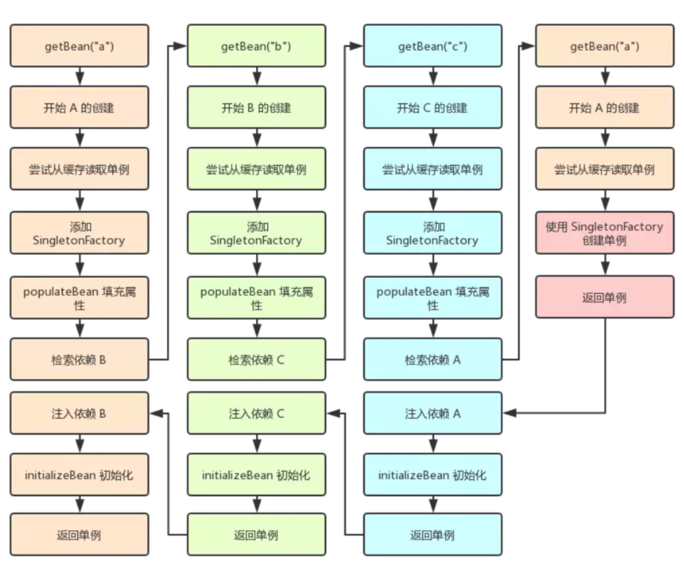
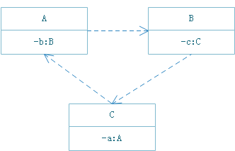

# SpringBean加载流程分析
> spring-beans-5.1.6.RELEASE

## Bean概念
在`Spring`中，`Bean`被定义为`BeanDefinition`，描述一个`bean`实例，包括属性值、构造函数参数值等信息。

## Bean准备过程，创建完整定义的`BeanDefinition`
`Bean`在执行初始化之前，必须获得其完整的类信息，需要合并父类定义。  
```java
//DefaultListableBeanFactory
public void preInstantiateSingletons() throws BeansException {
    ...
    RootBeanDefinition bd = getMergedLocalBeanDefinition(beanName);
    ...
}
```

```java
//AbstractBeanFactory
/**
 * Return a RootBeanDefinition for the given bean, by merging with the
 * parent if the given bean's definition is a child bean definition.
 * @param beanName the name of the bean definition
 * @param bd the original bean definition (Root/ChildBeanDefinition)
 * @param containingBd the containing bean definition in case of inner bean,
 * or {@code null} in case of a top-level bean
 * @return a (potentially merged) RootBeanDefinition for the given bean
 * @throws BeanDefinitionStoreException in case of an invalid bean definition
 */
protected RootBeanDefinition getMergedBeanDefinition(
		String beanName, BeanDefinition bd, @Nullable BeanDefinition containingBd)
		throws BeanDefinitionStoreException {

	...
			if (bd.getParentName() == null) {
                //如果没有继承，直接做为RootBeanDefinition
				// Use copy of given root bean definition.
				if (bd instanceof RootBeanDefinition) {
					mbd = ((RootBeanDefinition) bd).cloneBeanDefinition();
				}
				else {
					mbd = new RootBeanDefinition(bd);
				}
			}
			else {
				// Child bean definition: needs to be merged with parent.
				BeanDefinition pbd;
				try {
					String parentBeanName = transformedBeanName(bd.getParentName());
					if (!beanName.equals(parentBeanName)) {
                        //如果存在父类，递归合并依赖
						pbd = getMergedBeanDefinition(parentBeanName);
					}
					else {
						BeanFactory parent = getParentBeanFactory();
						if (parent instanceof ConfigurableBeanFactory) {
							pbd = ((ConfigurableBeanFactory) parent).getMergedBeanDefinition(parentBeanName);
						}
						...
					}
				}
				...
				// Deep copy with overridden values.
                // 使用完整定义创建RootBeanDefinition
				mbd = new RootBeanDefinition(pbd);
                //覆盖对 RootBeanDefinition的定义
				mbd.overrideFrom(bd);
			}
		...
}
```
## Bean初始化
```java
//DefaultListableBeanFactory
public void preInstantiateSingletons() throws BeansException {
    ...
    //获得Bean完整定义
    RootBeanDefinition bd = getMergedLocalBeanDefinition(beanName);
    ...
    //AbstractBeanFactory
    getBean(beanName);
    ...
}
```
```java
//AbstractBeanFactory
public Object getBean(String name) throws BeansException {
	return doGetBean(name, null, null, false);
}
```
```java
//AbstractBeanFactory
protected <T> T doGetBean(final String name, @Nullable final Class<T> requiredType,
		@Nullable final Object[] args, boolean typeCheckOnly) throws BeansException {
	...
    sharedInstance = getSingleton(beanName, () -> {
		try {
			return createBean(beanName, mbd, args);
		}
		...
	});
	...
}
```
```java
//DefaultSingletonBeanRegistry
/**
 * Return the (raw) singleton object registered under the given name,
 * creating and registering a new one if none registered yet.
 * @param beanName the name of the bean
 * @param singletonFactory the ObjectFactory to lazily create the singleton
 * with, if necessary
 * @return the registered singleton object
 */
public Object getSingleton(String beanName, ObjectFactory<?> singletonFactory) {
	....
		singletonObject = singletonFactory.getObject();
	...
}
```
```java
//AbstractAutowireCapableBeanFactory
/**
 * Central method of this class: creates a bean instance,
 * populates the bean instance, applies post-processors, etc.
 * @see #doCreateBean
 */
@Override
protected Object createBean(String beanName, RootBeanDefinition mbd, @Nullable Object[] args) throws BeanCreationException {
    ...
    Object beanInstance = doCreateBean(beanName, mbdToUse, args);
    ...
}
/**
 * Actually create the specified bean. Pre-creation processing has already happened
 * at this point, e.g. checking {@code postProcessBeforeInstantiation} callbacks.
 * <p>Differentiates between default bean instantiation, use of a
 * factory method, and autowiring a constructor.
 */
protected Object doCreateBean(final String beanName, final RootBeanDefinition mbd, final @Nullable Object[] args)
		throws BeanCreationException {
    ...
    //创建BeanWrapper
    instanceWrapper = createBeanInstance(beanName, mbd, args);
    ...
    //填充Bean依赖
    populateBean(beanName, mbd, instanceWrapper);
    //Bean初始化调用
    exposedObject = initializeBean(beanName, exposedObject, mbd);
    ...
}
```
#### #createBeanInstance 创建Bean实例
```java
//AbstractAutowireCapableBeanFactory
/**
 * Create a new instance for the specified bean, using an appropriate instantiation strategy:
 * factory method, constructor autowiring, or simple instantiation....
 */
protected BeanWrapper createBeanInstance(String beanName, RootBeanDefinition mbd, @Nullable Object[] args) {
    ...
    // No special handling: simply use no-arg constructor.
	return instantiateBean(beanName, mbd);
}
/**
 * Instantiate the given bean using its default constructor.
 * @param beanName the name of the bean
 * @param mbd the bean definition for the bean
 * @return a BeanWrapper for the new instance
 */
protected BeanWrapper instantiateBean(final String beanName, final RootBeanDefinition mbd) {
    ...
    //根据实例化策略实例化类
    beanInstance = getInstantiationStrategy().instantiate(mbd, beanName, parent);
    ...
    BeanWrapper bw = new BeanWrapperImpl(beanInstance);
    ...
}

```
#### #populateBean 填充Bean依赖
```java
//AbstractAutowireCapableBeanFactory
/**
 * Populate the bean instance in the given BeanWrapper with the property values
 * from the bean definition.
 */
@SuppressWarnings("deprecation")  // for postProcessPropertyValues
protected void populateBean(String beanName, RootBeanDefinition mbd, @Nullable BeanWrapper bw) {
    ...
    PropertyValues pvsToUse = ibp.postProcessProperties(pvs, bw.getWrappedInstance(), beanName);
    ...
}
```
```java
//AutowritedAnnotationBeanPostProcessor
public PropertyValues postProcessProperties(PropertyValues pvs, Object bean, String beanName) {
    InjectionMetadata metadata = findAutowiringMetadata(beanName, bean.getClass(), pvs);
	try {
		metadata.inject(bean, beanName, pvs);
	}
    ...
}
```
```java
//InjectionMetadata
public void inject(Object target, @Nullable String beanName, @Nullable PropertyValues pvs) throws Throwable {
    ...
    try {
        //从org.springframework.beans.factory.support.DefaultListableBeanFactory解析出依赖类
    	value = beanFactory.resolveDependency(desc, beanName, autowiredBeanNames, typeConverter);
    }
    ...
    //设置依赖
    field.set(bean, value);
}
```

## initializeBean Bean初始化调用
```java
/**
 * Initialize the given bean instance, applying factory callbacks
 * as well as init methods and bean post processors.
 * <p>Called from {@link #createBean} for traditionally defined beans,
 * and from {@link #initializeBean} for existing bean instances.
 */
protected Object initializeBean(final String beanName, final Object bean, @Nullable RootBeanDefinition mbd) {
	...
    //Aware注入
	invokeAwareMethods(beanName, bean);
	...

	Object wrappedBean = bean;
	if (mbd == null || !mbd.isSynthetic()) {
        //Bean前置处理
		wrappedBean = applyBeanPostProcessorsBeforeInitialization(wrappedBean, beanName);
        //ApplicationContextAwareProcessor
        //ConfigurationClassPostProcessor$ImportAwareBeanPostProcessor
        //PostProcessorRegisterationDelegate$BeanPostProcessor
        //CommonAnnotationBeanPostProcessor
        //AutowiredAnnotationBeanPostProcessor
        //ApplicationListenerDetctor
	}

	try {  
        //执行InitializingBean#afterPropertiesSet，然后执行init-method。
		invokeInitMethods(beanName, wrappedBean, mbd);
	}
	...
	if (mbd == null || !mbd.isSynthetic()) {
        //Bean后置处理
		wrappedBean = applyBeanPostProcessorsAfterInitialization(wrappedBean, beanName);
	}

	return wrappedBean;
}
```

## 加载流程


## Bean初始化过程的循环依赖
#### 什么是循环依赖

#### 循环依赖注入类型
- 构造器循环依赖  
  依赖的对象通过构造器传入，在Bean实始化时依赖
- 设值循环依赖  
  依赖对象通过`set`方法设置，在对象初始化之后

如果是`构造器循环依赖`，无法解决。如上图所示，`A`初始化时需要`B`,调用`B`初始化又需要`C`，再调用`C`初始化又需要`A`，导致无法完成类初化。

如果是`设值循环依赖`，`Spring`在`单例模式下`提供了类提前暴露功能，使其他实例可以引用该依赖。


#### 代码分析
```java
//DefaultSingletonBeanRegistry
/**
 * Return the (raw) singleton object registered under the given name.
 * <p>Checks already instantiated singletons and also allows for an early
 * reference to a currently created singleton (resolving a circular reference).
 */
@Nullable
protected Object getSingleton(String beanName, boolean allowEarlyReference) {
    //allowEarlyReference = true
    //尝试从singletonObjects取读
	Object singletonObject = this.singletonObjects.get(beanName);
	if (singletonObject == null && isSingletonCurrentlyInCreation(beanName)) {
		synchronized (this.singletonObjects) {
			singletonObject = this.earlySingletonObjects.get(beanName);
			if (singletonObject == null && allowEarlyReference) {
				ObjectFactory<?> singletonFactory = this.singletonFactories.get(beanName);
				if (singletonFactory != null) {
					singletonObject = singletonFactory.getObject();
                    //提前暴露
					this.earlySingletonObjects.put(beanName, singletonObject);
					this.singletonFactories.remove(beanName);
				}
			}
		}
	}
	return singletonObject;
}
```
主要涉及三级缓存中的获取
```java
/** Cache of singleton objects: bean name to bean instance. */
//第一级缓存，放置实例化好的单例对象
private final Map<String, Object> singletonObjects = new ConcurrentHashMap<>(256);

/** Cache of singleton factories: bean name to ObjectFactory. */
//第三级缓存，存放要被实例化的对象的对象工厂
private final Map<String, ObjectFactory<?>> singletonFactories = new HashMap<>(16);

/** Cache of early singleton objects: bean name to bean instance. */
//第二级缓存，存放提前曝光的单例对象
private final Map<String, Object> earlySingletonObjects = new HashMap<>(16);
```

## 更多参考
[图文并茂，揭秘 Spring 的 Bean 的加载过程](https://www.jianshu.com/p/9ea61d204559)  
[Spring IOC 源码解析五（非延迟加载bean的初始化）](https://www.jianshu.com/p/2a062157f372)  
[Spring框架是怎么解决Bean之间的循环依赖的](https://blog.csdn.net/Apeopl/article/details/90146337)  
