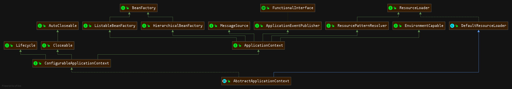

# 手撕SpringBoot-AnnotationConfigServletWebServerApplicationContext应用上下文容器

> [IOC容器](./SpringIOC.md)  
> Spring的IOC容器主要是`ApplicationContext`与`BeanFactory`
> 不同之处在于, `ApplicationContext`实现的是`立即加载`，即`读取创建`
> `BeanFactory`采取`延迟加载`策略，即`获取时创建`。

- <a href="#AnnotationConfigServletWebServerApplicationContext">AnnotationConfigServletWebServerApplicationContext</a>
    基于注解的`Servlet`的`Web`应用上下文。

    - <a href="#ServletWebServerApplicationContext">ServletWebServerApplicationContext</a>
    基于`Servlet`的 `Web`应用上下文。

        - <a href="#GenericWebApplicationContext">GenericWebApplicationContext</a>
            通用Web应用上下文容器

            - <a href="#GenericApplicationContext">GenericApplicationContext</a>
                通用应用上下文实现

                - <a href="#AbstractApplicationContext">AbstractApplicationContext</a> 通用的应用上下文

                    - <a href="#DefaultResourceLoader">DefaultResourceLoader</a>
                    资源加载器

## <a name="AnnotationConfigServletWebServerApplicationContext">AnnotationConfigServletWebServerApplicationContext</a>
> `ServletWebServerApplicationContext`子类

基于注解的`Servlet`的`Web`应用上下文。

可以根据`@Configuration`或者`@Component`注解的类，根据`Class Path Scanning`自动加载。

特别注意的是，该类在加载`@Configuration`注册的类时，后解析的`@Bean`定义会覆盖之前定义。 所以，可以根据此特性来覆盖重写某些`Bean`定义。

## <a name="ServletWebServerApplicationContext">ServletWebServerApplicationContext</a>

> `GenericWebApplicationContext`子类

基于`Servlet`的 `Web`应用上下文。

会根据应用上下文查找一个`ServletWebServerFactory`，并创建，初始化，启动一个`WebServer`。
并且，上下文中任何定义的`Servlet`、`Filter`都会被自动注册到`Web服务器`中。

在该类中，最重要的是初始化`dispatcherServlet`。

虽然该类可以被直接使用，但是正常情况下，建议使用`AnnotationConfigServletWebServerApplicationContext`或者`XmlServletWebServerApplicationContext`，而不是直接使用该类。

#### WbServer启动
```java
protected void onRefresh() {
	super.onRefresh();
	try {
		createWebServer();
	}
	...
}
```

## <a name="GenericWebApplicationContext">GenericWebApplicationContext</a>
> `Web环境`容器实现，`GenericApplicationContext`子类
>
> 这是一个相对复杂的类，实现了`ConfigurableWebApplicationContext`接口。
`ConfigurableWebApplicationContext`是一个可配置的`Web`应用上下文接口声明。这里先简单的认为是一个`Web`应用的标识，后续将祥解`基于Servlet的Web应用上下文`。

该类的作用目的不是用来根据传统的`web.xml`来启动，相反的，其用来根据代码的上下文进行构建。


## <a name="GenericApplicationContext">GenericApplicationContext</a>
> <a href="#AbstractApplicationContext">AbstractApplicationContext</a>的子类


通用的`ApplicationContext`实现，包含了一个单独的内部`DefaultListableBeanFactory`实现，
并且默认实现了`BeanDefinitionRegistry`用来注册`Bean`，通过`#refresh`方法来初始化这些`Bean`。

使用示例如：
```java
GenericApplicationContext ctx = new GenericApplicationContext();
//XmlBean加载
XmlBeanDefinitionReader xmlReader = new XmlBeanDefinitionReader(ctx);
xmlReader.loadBeanDefinitions(new ClassPathResource("applicationContext.xml"));
//PropertiesBean加载
PropertiesBeanDefinitionReader propReader = new PropertiesBeanDefinitionReader(ctx);
propReader.loadBeanDefinitions(new ClassPathResource("otherBeans.properties"));
//当Bean加载到容器中，进行refresh
ctx.refresh();

MyBean myBean = (MyBean) ctx.getBean("myBean");
```

#### refresh方法简解
该方法是用来初始完整的应用上下文的，包括加载`postProcessBeanFactory`进行`Bean`的处理  
初始化<a name="AbstractApplicationContext">messageSource</a>;
实始化<a name="AbstractApplicationContext">applicationEventMulticaster</a>；
注册监听器；
加载`Bean`等操作

## <a name="AbstractApplicationContext">AbstractApplicationContext</a>
> <a href=#DefaultResourceLoader>DefaultResourceLoader</a>的子类，模板模式。 [祥见](./SpringBoot-AbstractApplicationContext.md)



抽象实现的`ApplicationContext`类， 通用的应用上下文。

扩展了`DefaultResourceLoader`，支持非`URL`资源加载，同时支持加载包括完整包名的资源。

与普通的`BeanFactory`不同的是，该实现类支持检测特殊的内部定义类，并自动注册。  
如：`BeanFactoryPostProcessors、BeanPostProcessors、ApplicationListeners`

在初始化时，会将一个特定名为为`messageSource`的`MessageSource`和特定名为`applicationEventMulticaster`的`ApplicationEventMulticaster`作为`Bean`加载到应用上下文。

## <a name="DefaultResourceLoader">DefaultResourceLoader</a>
默认的接口`ResourceLoader`实现，可以独立使用。


提供`public Resource getResource(String location)`实现，用来加载资源，根据类别解析为`UrlResource、FileUrlResource、ClassPathResource`或者其内部实现类`ClassPathContextResource（ClassPathResource的子类）`
