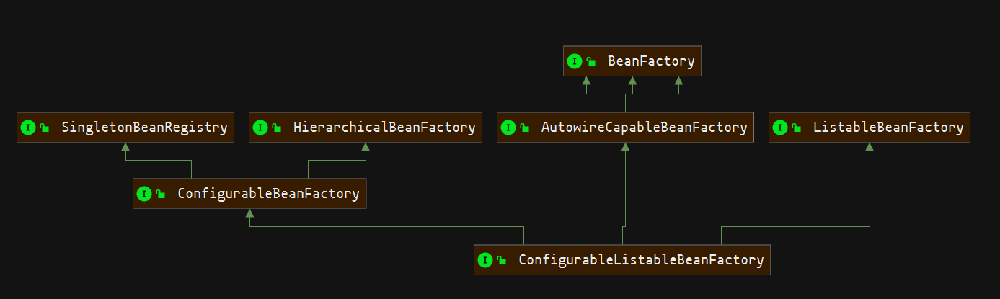

# Spring IOC容器
SpringIOC容器提供了两种实现
- `BeanFactory`：IOC容器的基础接口，提供了基础的容器访问能力。提供了`懒加载`方式，`Bean`只有在被获取的时候才会进行实例化。

- `ApplicationContext`：`BeanFactory`的子类。包含了`BeanFactory`的所有功能，并此进行功能扩展，并且采用`预加载`的方式，在`ApplicationContext`启动后实例化。  
    扩展功能：
    - Bean instantiation/wiriting
    - Bean实例化/串联
    - 自动BeanPostProcessor注册(BeanFactory手动)
    - 自动BeanFactoryPostProcessor注册(BeanFactory手动)
    - MessageSource
    - ApplicationEvent事件

## 实现原理
- 依赖倒置
- 控制反转

## BeanFactory

- `ListableBeanFactory` 提供容器的Bean实例枚举功能，而不需要逐个匹配查询。通常如果是预加载的`BeanFactory`会实现该接口。

- `AutowireCapableBeanFactory` 提供容器之外的Bean注入装配功能。
>  注意：原对象可以不在Spring的IOC容器里，但是依赖注入的对象，必须是Spring容器的Bean。[祥见AbstractAutowireCapableBeanFactory#createBean](SpringBoot-AbstractAutowireCapableBeanFactory.md#createBean)

## 相关文档
- <a href="./SpringBean加载.md#circularReference">Bean加载&循环依赖</a>
