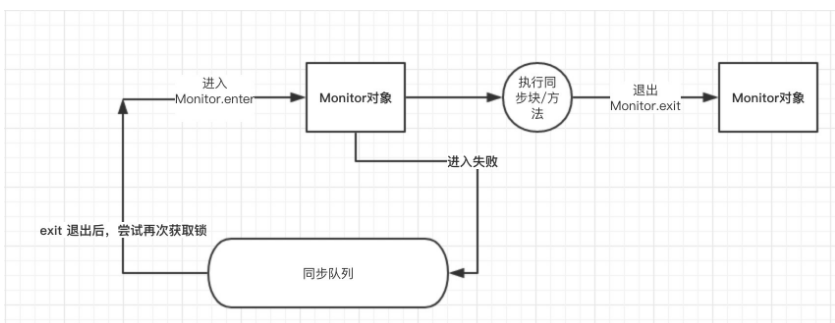

# synchronized 解析

#### `synchronized` 使用方式：
 - 修饰实例方法， 作用于当前实例锁

```java
 public synchronized void test(){
     //todo ...
     //  类似 synchronized(this)
 }
 ```

 - 修饰静态方法，作用于当前类对象锁

```java
 //class Test
 public static synchronized void test(){
     //todo ...
     //由于静态成员不专属于任何一个实例， 是类成员， 所以，此时锁的是类对应的`Test.class`对象
     // 也就是等价于：  synchronized(Test.class){}
 }
 ```

 - 修饰代码块， 指定加锁对象，对给定的对象加锁

```java
 public void test(){
     synchronized(this){
         //todo ...
     }
 }
 ```


#### `synchronized` 原理：
`JVM`中的同步(`synchronized`)是基于进入和退出管理(`Monitor`)对象实现

```java
public class T {

    public static void main(String[] args) {
        synchronized (T.class){
            System.out.println("hai");
        }
    }
}
```
编译后：
```java
// class version 52.0 (52)
// access flags 0x21
public class com/atencn/baobao/recommend/T {

  // compiled from: T.java

  // access flags 0x1
  public <init>()V
   L0
    LINENUMBER 8 L0
    ALOAD 0
    INVOKESPECIAL java/lang/Object.<init> ()V
    RETURN
   L1
    LOCALVARIABLE this Lcom/atencn/baobao/recommend/T; L0 L1 0
    MAXSTACK = 1
    MAXLOCALS = 1

  // access flags 0x9
  public static main([Ljava/lang/String;)V
    // parameter  args
    TRYCATCHBLOCK L0 L1 L2 null
    TRYCATCHBLOCK L2 L3 L2 null
   L4
    LINENUMBER 11 L4
    LDC Lcom/atencn/baobao/recommend/T;.class
    DUP
    ASTORE 1
    MONITORENTER //=========进入
   L0
    LINENUMBER 12 L0
    GETSTATIC java/lang/System.out : Ljava/io/PrintStream;
    LDC "hai"
    INVOKEVIRTUAL java/io/PrintStream.println (Ljava/lang/String;)V
   L5
    LINENUMBER 13 L5
    ALOAD 1
    MONITOREXIT //=========正常退出
   L1
    GOTO L6
   L2
   FRAME FULL [[Ljava/lang/String; java/lang/Object] [java/lang/Throwable]
    ASTORE 2
    ALOAD 1
    MONITOREXIT //=========异常退出
   L3
    ALOAD 2
    ATHROW
   L6
    LINENUMBER 14 L6
   FRAME CHOP 1
    RETURN
   L7
    LOCALVARIABLE args [Ljava/lang/String; L4 L7 0
    MAXSTACK = 2
    MAXLOCALS = 3
}

```
也就是说， `synchronized`具体实现在编译之后在同步方法调用之前加入一个 `monitor.enter`指令， 在退出方法和异常插入`monitor.exit`指令， 本质就是对一个对象监视器 (`monitor`)进行获取，而这个获取过程具有排他性，从而达到线程同步



#### `JVM`对`synchronized`的优化
锁的状态分为四种， 无锁状态、 偏向锁、 轻量级锁和重量级锁。

- 偏向锁
  - 偏向锁是`Java6`之后加入的新锁， 它是一种针对锁操作的优化手段。
  - 偏向锁的核心思想是， 如果一个线程获得了锁，那么锁就会进入偏向模式，当这个线程再请求锁时， 无需再做任务同步操作，即获取锁。 该锁对没有锁竞争的场合，会有很好的优化效果，但是，如果锁竞争比较激烈的情况下，偏向锁就会失效，升级为轻量级锁。
  - 偏向锁的核心就是认为，很多情况下，有可能连续多次的申请锁都是同一个线程申请的
  - 锁：
    - 线程访问同步块时， 使用`CAS`将线程Id更新到锁对象的 `Mark Word`中， 如果更新成功，则获取偏向锁，并且之后每次进入这个对象锁相关的同步块时都不需要再次获取锁了。`也就是重入性！！这点很重要`
    - 如果更新失败， 检查锁对象的 `Mark Work` 是否指向当前线程， 如果是，直接进入同步块，如果不是，升级为轻量琐
  - 释放锁：
    - 当有另外一个线程获取这个锁时，持有偏向锁的线程就会释放锁，释放时会等待全局安全点(这一时刻没有字节码运行)，接着会暂停拥有偏向锁的线程，根据锁对象目前是否被锁来判定将对象头中的 Mark Word 设置为无锁或者是轻量锁状态。
    - 偏向锁可以提高带有同步却没有竞争的程序性能，但如果程序中大多数锁都存在竞争时，那偏向锁就起不到太大作用。可以使用 -XX:-userBiasedLocking=false 来关闭偏向锁，并默认进入轻量锁。

- 轻量级锁
  - 轻量级锁认为，对绝大部分的锁，在整个同步周期内都不存在竞争，其所适应的场景是线程交替执行同步块，如果存在同一时间访问同一锁的话，就会升级为重量级琐。
  - 如果锁竞争激烈，轻量级锁不但会有互斥的开锁，还会有`CAS`的开锁，甚至比重量锁更慢。
  - 琐：
    - 尝试使用`CAS`更新线程Id到锁对象`Mark Work`中，如果更新失败，判断是否为当前线程拥有锁对象，如果是，直接进入同步块，如果不是则自旋，如果自旋失败，则升级为重量级锁
  - 解琐：
    - 使用`CAS`更新`Mark Work`中的线程Id， 如果替换成功，则说明同步操作完成，如果失败，说明有其他线程尝试获取琐，此时锁已经变更为重量级琐，所以，就会唤醒被挂的线程.

- 自旋琐
  - 大多数情况下，线程持有琐的时间会太长，所以自旋锁会假设只需要等待一会，当前线程就可以获得锁，所以，会让当前线程做几个空循环，如果循环后还不能获得锁，就将线程挂起，升级为重量级琐

- 锁消除
  - `JVM`在 `JIT`编译时，通过对运行上下文扫描，去除不可能有存在共享资源竞争的锁，通过这种方式消除没有必要的锁，节省请求锁时间。 如： StringBuffer的使用：
  ```java
  public void test(){
      StringBuffer buffer = new StringBuffer();
      //todo ....
  }
  ```
  此时buffer是不会有锁竞争的， 所以 `JVM`会消除锁。
