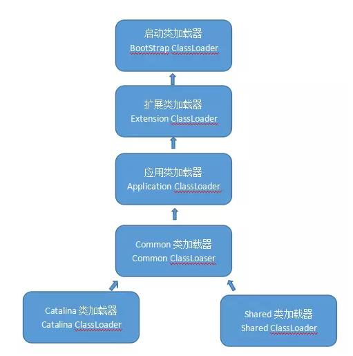

# Tomcat9: Bootstrap

```java
//加载/common/ 加载 catalina 相关顶层公用的类，默认扫描 CATALINA_HOME, CATALINA_BASE 下的class
ClassLoader commonLoader = null;
//加载/server/ 加载tomcat 应用相关的类
ClassLoader catalinaLoader = null;
//加载/shared/ 加载 Web 应用的类
ClassLoader sharedLoader = null;
```

#init

```java
/**
 * Initialize daemon.
 * @throws Exception Fatal initialization error
 */
public void init() throws Exception {

    //初始化加载器
    initClassLoaders();
    //将 catalinaLoader 类加载器设置为当前线程上下文类加载器
    Thread.currentThread().setContextClassLoader(catalinaLoader);

    SecurityClassLoad.securityClassLoad(catalinaLoader);

    // Load our startup class and call its process() method
    if (log.isDebugEnabled())
        log.debug("Loading startup class");

    //加载Catalina类，利用反射机制进行调用
    //Catalina根据JMX进行组件初始化，包括了StandardContext的WebappLoader
    //JMX，是Java Management Extensions(Java管理扩展)
    //也就是WebappLoader的加载机制破坏了双亲委派原则
    //所有的SPI实现都同样破坏了双亲委派原则
    Class<?> startupClass = catalinaLoader.loadClass("org.apache.catalina.startup.Catalina");
    Object startupInstance = startupClass.getConstructor().newInstance();

    // Set the shared extensions class loader
    if (log.isDebugEnabled())
        log.debug("Setting startup class properties");
    String methodName = "setParentClassLoader";
    Class<?> paramTypes[] = new Class[1];
    paramTypes[0] = Class.forName("java.lang.ClassLoader");
    Object paramValues[] = new Object[1];
    paramValues[0] = sharedLoader;
    Method method =
        startupInstance.getClass().getMethod(methodName, paramTypes);
    method.invoke(startupInstance, paramValues);

    catalinaDaemon = startupInstance;

}
```
附：[Catalina解析](./Catalina.md)

#initClassLoaders

```java
private void initClassLoaders() {
    try {
        commonLoader = createClassLoader("common", null);
        if( commonLoader == null ) {
            // no config file, default to this loader - we might be in a 'single' env.
            commonLoader=this.getClass().getClassLoader();
        }
        catalinaLoader = createClassLoader("server", commonLoader);
        sharedLoader = createClassLoader("shared", commonLoader);
    } catch (Throwable t) {
        handleThrowable(t);
        log.error("Class loader creation threw exception", t);
        System.exit(1);
    }
}
```


#createClassLoader
```java
private ClassLoader createClassLoader(String name, ClassLoader parent)
        throws Exception {
    //获取 catalina.properties 中对应的 name + ".loader"配置
    //如：common.loader="${catalina.base}/lib","${catalina.base}/lib/*.jar","${catalina.home}/lib","${catalina.home}/lib/*.jar"
    String value = CatalinaProperties.getProperty(name + ".loader");
    if ((value == null) || (value.equals("")))
        //如果获取不到加载器的配置，使用父加载器进行加载
        return parent;
    //对配置进行解析，主要解析value中的 ${catalina.home} 或 ${catalina.base}
    //catalina.home(安装目录)：指向公用信息的位置，就是bin和lib的父目录。
    //catalina.base(工作目录)：指向每个Tomcat目录私有信息的位置，就是conf、logs、temp、webapps和work的父目录
    //仅运行一个Tomcat实例时，这两个属性指向的位置是相同的。
    value = replace(value);

    List<Repository> repositories = new ArrayList<>();
    //解析地址
    String[] repositoryPaths = getPaths(value);
    //解析地址设置类型
    for (String repository : repositoryPaths) {
        // Check for a JAR URL repository
        try {
            @SuppressWarnings("unused")
            URL url = new URL(repository);
            repositories.add(new Repository(repository, RepositoryType.URL));
            continue;
        } catch (MalformedURLException e) {
            // Ignore
        }

        // Local repository
        if (repository.endsWith("*.jar")) {
            repository = repository.substring
                (0, repository.length() - "*.jar".length());
            repositories.add(new Repository(repository, RepositoryType.GLOB));
        } else if (repository.endsWith(".jar")) {
            repositories.add(new Repository(repository, RepositoryType.JAR));
        } else {
            repositories.add(new Repository(repository, RepositoryType.DIR));
        }
    }
    //创建类加载器
    return ClassLoaderFactory.createClassLoader(repositories, parent);
}

```

#createClassLoader
```java
public static ClassLoader createClassLoader(List<Repository> repositories,
                                                final ClassLoader parent)
        throws Exception {

    if (log.isDebugEnabled())
        log.debug("Creating new class loader");

    // Construct the "class path" for this class loader
    Set<URL> set = new LinkedHashSet<>();

    if (repositories != null) {
        for (Repository repository : repositories)  {
            if (repository.getType() == RepositoryType.URL) {
                //如果是一个Url地址
                URL url = buildClassLoaderUrl(repository.getLocation());
                if (log.isDebugEnabled())
                    log.debug("  Including URL " + url);
                //直接加载到Set中
                set.add(url);
            } else if (repository.getType() == RepositoryType.DIR) {
                File directory = new File(repository.getLocation());
                directory = directory.getCanonicalFile();
                if (!validateFile(directory, RepositoryType.DIR)) {
                    continue;
                }
                //如果是一个目录，将目录添加到Set中
                URL url = buildClassLoaderUrl(directory);
                if (log.isDebugEnabled())
                    log.debug("  Including directory " + url);
                set.add(url);
            } else if (repository.getType() == RepositoryType.JAR) {
                File file=new File(repository.getLocation());
                file = file.getCanonicalFile();
                if (!validateFile(file, RepositoryType.JAR)) {
                    continue;
                }
                //如果是一个Jar包
                URL url = buildClassLoaderUrl(file);
                if (log.isDebugEnabled())
                    log.debug("  Including jar file " + url);
                set.add(url);
            } else if (repository.getType() == RepositoryType.GLOB) {
                //如果是 /lib/*.jar的目录结构
                File directory=new File(repository.getLocation());
                directory = directory.getCanonicalFile();
                if (!validateFile(directory, RepositoryType.GLOB)) {
                    continue;
                }
                if (log.isDebugEnabled())
                    log.debug("  Including directory glob "
                        + directory.getAbsolutePath());
                //获取所有的文件
                String filenames[] = directory.list();
                if (filenames == null) {
                    continue;
                }
                for (int j = 0; j < filenames.length; j++) {
                    String filename = filenames[j].toLowerCase(Locale.ENGLISH);
                    if (!filename.endsWith(".jar"))
                        continue;
                    File file = new File(directory, filenames[j]);
                    file = file.getCanonicalFile();
                    if (!validateFile(file, RepositoryType.JAR)) {
                        continue;
                    }
                    if (log.isDebugEnabled())
                        log.debug("    Including glob jar file "
                            + file.getAbsolutePath());
                    URL url = buildClassLoaderUrl(file);
                    set.add(url);
                }
            }
        }
    }

    // Construct the class loader itself
    final URL[] array = set.toArray(new URL[set.size()]);
    if (log.isDebugEnabled())
        for (int i = 0; i < array.length; i++) {
            log.debug("  location " + i + " is " + array[i]);
        }
    //特权代码加载
    return AccessController.doPrivileged(
            new PrivilegedAction<URLClassLoader>() {
                @Override
                public URLClassLoader run() {
                    if (parent == null)
                        return new URLClassLoader(array);
                    else
                        return new URLClassLoader(array, parent);
                }
            });
}
```
