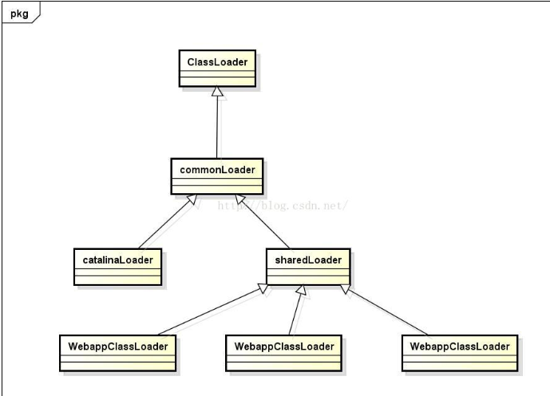

Bootstrap Loader：加载lib目录下或者System.getProperty(“sun.boot.class.path”)、或者-XBootclasspath所指定的路径或jar。

Extended Loader：加载lib\ext目录下或者System.getProperty(“java.ext.dirs”) 所指定的 路径或jar。在使用Java运行程序时，也可以指定其搜索路径，例如：java -Djava.ext.dirs=d:\projects\testproj\classes HelloWorld。

AppClass Loader：加载System.getProperty(“java.class.path”)所指定的 路径或jar。在使用Java运行程序时，也可以加上-cp来覆盖原有的Classpath设置，例如： java -cp ./lavasoft/classes HelloWorld

根据java虚拟机的双亲委派模式的原则，类加载器在加载一个类时，首先交给父类加载器加载，层层往上直到Bootstrap Loader。也就是一个类最先由Bootstrap Loader加载，如果没有加载到，则交给下一层的类加载器加载，如果没有加载到，则依次层层往下，直到最下层的类加载器。这也就是说，凡是能通过父一级类加载器加载到的类，对于子类也是可见的。因此可以利用双亲委派模式的特性，使用类加载器对不同路径下的jar包或者类进行环境隔离。

结合之前对双亲委派模式的类加载过程的描述，对上图所示类加载体系进行介绍：

ClassLoader：Java提供的类加载器抽象类，用户自定义的类加载器需要继承实现

commonLoader：Tomcat最基本的类加载器，加载路径中的class可以被Tomcat容器本身以及各个Webapp访问；

catalinaLoader：Tomcat容器私有的类加载器，加载路径中的class对于Webapp不可见；

sharedLoader：各个Webapp共享的类加载器，加载路径中的class对于所有Webapp可见，但是对于Tomcat容器不可见；

WebappClassLoader：各个Webapp私有的类加载器，加载路径中的class只对当前Webapp可见；
