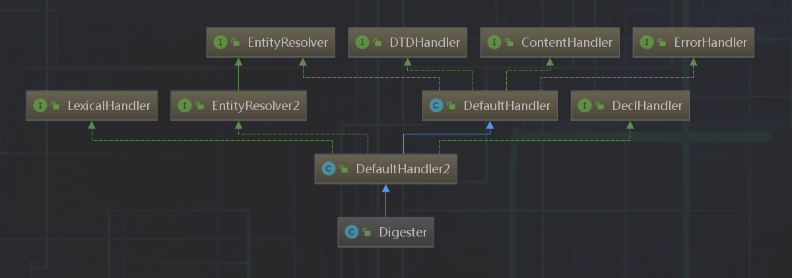

# Tomcat9:Digester XML解析

Digester是一个让你可以根据配置的规则（rules)，解析一个xml到java对象印射。

该类与开源框架：Digester存在一定的差异。 Tomcat在之前将其引用到内部。



- 方要方法
    - `setRulesValidate(boolean)`

        设置rules是否需要验证，必须在#parse之前调用 ，如果设置为true,规则不存在时打印警告信息，与`逻辑无关`！
    - `setValidating(boolean)`

        设置Parse验证标识，必须在#parse之前调用

        如果设置为true, 会进行XML配置校验，DTD/schema
    - `setFakeAttributes`

        设置为伪属性，伪属性不会在节点解析时调用对应的setter方法（默认在解析节点时会调用setter方法）
    - `addObjectCreate(String pattern, String className, String attributeName)`

        创建一个对象，并放到栈顶

        pattern : 匹配规则

        className : 默认实体类名

        attributeName : 属性名称，如果没有存在，则使用默认实体类名，如果存在使用配置的

        `digester.addObjectCreate("project/parent", "com.magneton.frame.digester.Parent", "className");`

        在project/parent时创建一个Parent对象，关放置在栈顶

    - `addSetProperties`

        调用栈顶的对象属性set方法

        `digester#addSetProperties("project/parent")`,

        就是遇到paroject/parent时根据attribute调用setter方法

        上面的代码就会产生如下类似调用： `Parent#setGroupdId("123")

    - 'addSetNext(String pattern, String methodName, String paramType)`
        调用当前栈顶的下一位的对象并调用setter方法

        pattern : 匹配的节点

        methodName : 调用父节点的方法

        paramType : 父节点的方法接收的参数类型

        `digester.addSetNext("project/parent", "setDependency", "com.magneton.frame.digester.Dependency");`

        在project/parent时，调用Parent父类的setDependency方法


- 完整示例代码：

    - xml

        ```xml
            <?xml version="1.0" encoding="UTF-8"?>
            <project>
                <parent groupId="123" artifactId="456" version="0.0.1" />
            </project>
        ```

    - DigesterText.java

        ```java
        public class DigesterTest {

            private Parent parent;

            public static void main(String[] args) {
                DigesterTest test = new DigesterTest();
                try (InputStream resource = DigesterTest.class.getResourceAsStream("/pom.xml")) {
                    Digester digester = new Digester();
                    digester.addObjectCreate("project/parent", "com.magneton.frame.digester.Parent", "className");
                    digester.addSetProperties("project/parent");
                    digester.addSetNext("project/parent", "setParent", "com.magneton.frame.digester.Parent");
                    digester.push(test);
                    digester.parse(resource);


                    Parent parent = test.getParent();

                    System.out.println(parent.getGroupId());//123
                    System.out.println(parent.getArtifactId());//456
                    System.out.println(parent.getVersion());//0.0.1


                } catch (Throwable e) {
                    e.printStackTrace();
                }
            }

            //省略getter&setter
        }

        ```

    - Parent.java

        ```java
        public class Parent {
            private String groupId = "g";
            private String artifactId;
            private String version;
            //省略getter&setter
        }
        ```
