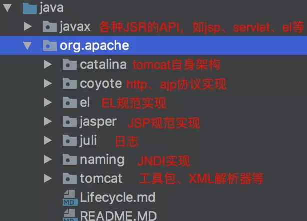

# Tomcat9

- 目录结构

Tomcat 整体的框架层次：4个层次, 其中 Connector 和 Container 是最重要的.

  - Server 和 Service
  - Connector
    - HTTP
    - AJP (apache 私有协议，用于tomcat和apache静态服务器通信)
  - Container
    - Engine
    - Host
    - Context
    - Wrapper
  - Component
    - Manager （管理器）
    - logger （日志管理）
    - loader （载入器）
    - pipeline (管道)
    - valve （管道中的阀）

- Connector 组件:

  Tomcat都是在容器里面处理问题的， 而容器又到哪里去取得输入信息呢？ Connector就是专干这个的。 他会把从socket传递过来的数据， 封装成Request, 传递给容器来处理。 通常我们会用到两种Connector,一种叫http connectoer， 用来传递http需求的。 另一种叫AJP， 在我们整合apache与tomcat工作的时候，apache与tomcat之间就是通过这个协议来互动的。 （说到apache与tomcat的整合工作， 通常我们的目的是为了让apache 获取静态资源， 而让tomcat来解析动态的jsp或者servlet。）

- Container 组件:

  容器从大到小分别是 Engine, Host, Context, Wrapper, 从左到右每个容器都是一对多关系, 也就是说, Engine 容器可以有多个 Host 容器, Host 容器可以有多个 Context 容器. Context 容器可以有多个 Wrapper 容器.

  我们来看看每个组件的解释:

  Container：可以理解为处理某类型请求的容器，处理的方式一般为把处理请求的处理器包装为Valve(阀门)对象，并按一定顺序放入类型为Pipeline(管道)的管道里。

  Container有多种子类型：Engine、Host、Context和Wrapper，这几种子类型Container依次包含，处理不同粒度的请求。

  另外Container里包含一些基础服务，如Loader、Manager和Realm。
  - Engine：Engine包含Host和Context，接到请求后仍给相应的Host在相应的Context里处理。
  - Host：就是我们所理解的虚拟主机。
  - Context：就是我们所部属的具体Web应用的上下文，每个请求都在是相应的上下文里处理的。
  - Wrapper：Wrapper是针对每个Servlet的Container，每个Servlet都有相应的Wrapper来管理。 可以看出Server、Service、Connector、Container、Engine、Host、Context和Wrapper这些核心组件的作用范围是逐层递减，并逐层包含。

  下面就是些被Container所用的基础组件：
  - Loader：是被Container用来载入各种所需的Class。
  - Manager：是被Container用来管理Session池。
  - Realm：是用来处理安全里授权与认证。

- Component 组件:

 需求被传递到了容器里面， 在合适的时候， 会传递给下一个容器处理。而容器里面又盛装着各种各样的组件， 我们可以理解为提供各种各样的增值服务。比如:

  - manager: 当一个容器里面装了manager组件后，这个容器就支持session管理了， 事实上在tomcat里面的session管理, 就是靠的在context里面装的manager component.

  - logger: 当一个容器里面装了logger组件后， 这个容器里所发生的事情， 就被该组件记录下来, 我们通常会在logs/ 这个目录下看见catalina_log.time.txt 以及localhost.time.txt和localhost_examples_log.time.txt。 这就是因为我们分别为：engin, host以及context(examples)这三个容器安装了logger组件， 这也是默认安装， 又叫做标配 .

  - loader: loader这个组件通常只会给我们的context容器使用，loader是用来启动context以及管理这个context的classloader用的。

  - pipline: pipeline是这样一个东西，使用的责任链模式.  当一个容器决定了要把从上级传递过来的需求交给子容器的时候， 他就把这个需求放进容器的管道(pipeline)里面去。 而需求傻呼呼得在管道里面流动的时候， 就会被管道里面的各个阀门拦截下来。 比如管道里面放了两个阀门。 第一个阀门叫做“access_allow_vavle”， 也就是说需求流过来的时候，它会看这个需求是哪个IP过来的， 如果这个IP已经在黑名单里面了，sure, 杀！ 第二个阀门叫做“defaul_access_valve”它会做例行的检查， 如果通过的话，OK， 把需求传递给当前容器的子容器。 就是通过这种方式， 需求就在各个容器里面传递，流动， 最后抵达目的地的了。

  - valve: 就是上面所说的阀门。

基于JMX Tomcat会为每个组件进行注册过程，通过Registry管理起来，而Registry是基于JMX来实现的，因此在看组件的init和start过程实际上就是初始化MBean和触发MBean的start方法，会大量看到形如： Registry.getRegistry(null, null).invoke(mbeans, "init", false); Registry.getRegistry(null, null).invoke(mbeans, "start", false); 这样的代码，这实际上就是通过JMX管理各种组件的行为和生命期。

那么, 什么是 JMX 呢?

> JMX 即 Java Management Extensions(JMX 规范), 是用来对 tomcat 进行管理的. tomcat 中的实现是 > commons modeler 库, Catalina 使用这个库来见哈编写托管 Bean 的工作. 托管 Bean 就是用来管理 > > Catalina 中其他对象的 Bean.

事件侦听(观察者模式/事件驱动) 各个组件在其生命期中会有各种各样行为，而这些行为都有触发相应的事件，Tomcat就是通过侦听这些时间达到对这些行为进行扩展的目的。在看组件的init和start过程中会看到大量如： lifecycle.fireLifecycleEvent(AFTER_START_EVENT, null);这样的代码，这就是对某一类型事件的触发，如果你想在其中加入自己的行为，就只用注册相应类型的事件即可。
