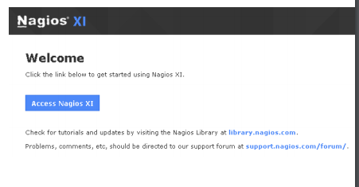
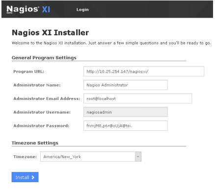
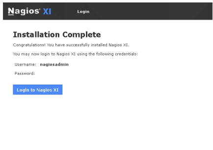

# Nagios XI Linux安装
 - from [nagiosxi.docs](https://assets.nagios.com/downloads/nagiosxi/docs/Installing-Nagios-XI-Manually-on-Linux.pdf#_ga=2.202408724.426440209.1545094410-820561858.1545094410)

 - 安装前置条件
  - 以Root权限安装

 >  Nagios强烈建议且只支持在一个干净的系统安装(没有安装或配置其他的任务东西)，否则可能安装失败

 - 快速安装
  `curl https://assets.nagios.com/downloads/nagiosxi/install.sh | sh`
  > 将自动下载并安装 Nagiosxi

 - 手动下载
  ```sh
  cd /tmp
  wget https://assets.nagios.com/downloads/nagiosxi/xi-latest.tar.gz
  tar xzf xi-latest.tar.gz
  cd nagiosxi
  ./fullinstall
  ```

  > 其他版本： https://assets.nagios.com/downloads/nagiosxi/versions.php

 - 最终安装
 > 如果安装成功，你将会看下如下信息：

 ```
 Nagios XI Installation Complete!
 \------------------------------
 You can access the Nagios XI web interface by visiting:
 http://<server_ip_address>/nagiosxi
 ```

以上，表示安装成功， 你可以使用接口地址来访问`Web`界面了。


- 配置
 - 点击 Access Nagios XI 按钮
 - 修改管理员账号密码

 

 - 点击 Install 按钮

 
