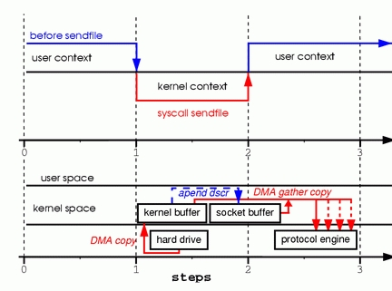

# Kafka
## 认识Kafka
Kafka是一个分布式流平台，能够：
- 发布/订阅流式记录，类似于消息队列
- 容错存储流式记录
- 实时处理流数据

## 核心
### Topic 数据主题
Topic 就是数据主题，是数据记录发布的地方,可以用来区分业务系统。Kafka中的Topics总是多订阅者模式，一个topic可以拥有一个或者多个消费者来订阅它的数据。

对于每一个topic， Kafka集群都会维持一个分区日志，如下所示

每个分区都是有序且顺序不可变的记录集，并且不断地追加到结构化的`commit log`文件。分区中的每一个记录都会分配一个id号来表示顺序，我们称之为`offset`（偏移量），`offset`用来唯一的标识分区中每一条记录。

Kafka 集群保留所有发布的记录—无论他们是否已被消费—并通过一个可配置的参数——`保留期限来控制`. 举个例子， 如果保留策略设置为2天，一条记录发布后两天内，可以随时被消费，两天过后这条记录会被抛弃并释放磁盘空间。Kafka的性能和数据大小无关，所以长时间存储数据没有什么问题.

### 消费模型

在每一个消费者中唯一保存的元数据是`offset（偏移量）`即消费在log中的位置.偏移量由消费者所控制:通常在读取记录后，消费者会以线性的方式增加偏移量，但是实际上，由于这个位置由消费者控制，所以消费者可以采用任何顺序来消费记录。例如，一个消费者可以重置到一个旧的偏移量，从而重新处理过去的数据；也可以跳过最近的记录，从"现在"开始消费。

### 日志分区
日志中的 `partition（分区）`有以下几个用途。

##### 当日志大小超过了单台服务器的限制，允许日志进行扩展
每个单独的分区都必须受限于主机的文件限制，不过一个主题可能有多个分区，因此可以处理无限量的数据。

##### 可以作为并行的单元集
###### 分布式
日志的分区`partition （分布）`在Kafka集群的服务器上。每个服务器在处理数据和请求时，共享这些分区。每一个分区都会在已配置的服务器上进行备份，确保容错性.

每个分区都有一台 server 作为 “`leader`”，零台或者多台server作为 `follwers` 。`leader server 处理一切对 partition （分区）的读写请求`，而`follwers`只需被动的同步leader上的数据。当leader宕机了，followers 中的一台服务器会自动成为新的 leader。每台 server 都会成为某些分区的 leader 和某些分区的 follower，因此集群的负载是平衡的。

###### 生产者
生产者可以将数据发布到所选择的`topic（主题）`中。生产者负责将记录分配到`topic`的哪一个 `partition（分区）`中。可以使用循环的方式来简单地实现负载均衡，也可以根据某些语义分区函数(例如：记录中的key)来完成。下面会介绍更多关于分区的使用。

###### 消费者
消费者使用一个 `消费组` 名称来进行标识，发布到topic中的每条记录被分配给订阅消费组中的一个消费者实例.消费者实例可以分布在多个进程中或者多个机器上。

如果所有的消费者实例在同一消费组中，消息记录会负载平衡到每一个消费者实例.
> 每个 Consumer Group 可以包含多个消费实例，即可以启动多个消息队列 Kafka 版 Consumer，并把参数 group.id 设置成相同的值。属于同一个 Consumer Group 的消费实例会负载消费订阅的 Topic。
>
>  举例：Consumer Group A 订阅了 Topic A，并开启三个消费实例 C1、C2、C3，则发送到 Topic A 的每条消息最终只会传给 C1、C2、C3 的某一个。Kafka 默认会均匀地把消息传给各个消息实例，以做到消费负载均衡。
>
> Kafka 负载消费的内部原理是，把订阅的 Topic 的分区，平均分配给各个消费实例。因此，消费实例的个数不要大于分区的数量，否则会有实例分配不到任何分区而处于空跑状态。这个负载均衡发生的时间，除了第一次启动上线之外，后续消费实例发生重启、增加、减少等变更时，都会触发一次负载均衡。

如果所有的消费者实例在不同的消费组中，每条消息记录会广播到所有的消费者进程.
> 一个 Consumer Group 可以订阅多个 Topic。 一个 Topic 也可以被多个 Consumer Group 订阅，且各个 Consumer Group 独立消费 Topic 下的所有消息。
>
> 举例：Consumer Group A 订阅了 Topic A，Consumer Group B 也订阅了 Topic A，则发送到 Topic A 的每条消息，不仅会传一份给 Consumer Group A 的消费实例，也会传一份给 Consumer Group B 的消费实例，且这两个过程相互独立，相互没有任何影响。（`消息广播`）
>
> 同一个 Consumer Group 内，各个消费实例订阅的 Topic 最好保持一致，避免给排查问题带来干扰。

在Kafka中实现消费的方式是将日志中的分区划分到每一个消费者实例上，以便在任何时间，每个实例都是分区唯一的消费者。维护消费组中的消费关系由Kafka协议动态处理。`如果新的实例加入组，他们将从组中其他成员处接管一些 partition 分区;如果一个实例消失，拥有的分区将被分发到剩余的实例。`

Kafka 只保证分区内的记录是有序的，而不保证主题中不同分区的顺序。每个 `partition` 分区按照`key值排序`足以满足大多数应用程序的需求。但如果你需要总记录在所有记录的上面，可使用仅有一个分区的主题来实现，这意味着每个消费者组只有一个消费者进程。

## 持久化
磁盘的顺序写入性完完高于随机写入的性能。

因为线性的读取和写入是磁盘使用模式中最有规律的，并且由操作系统进行了大量的优化。现代操作系统提供了 read-ahead 和 write-behind 技术，read-ahead 是以大的 data block 为单位预先读取数据，而 write-behind 是将多个小型的逻辑写合并成一次大型的物理磁盘写入。

`顺序磁盘访问在某些情况下比随机内存访问还要快！`

此外，Kafka是建立在JVM之上的，JAVA内存使用存在问题：
- 对象的内存开销非常高，通常是所存储的数据的两倍(甚至更多)
- 随着堆中数据的增加，Java 的垃圾回收变得越来越复杂和缓慢

相比于维护尽可能多的 `in-memory cache`，并且在空间不足的时候匆忙将数据 `flush` 到文件系统，我们把这个过程倒过来。所有数据一开始就被写入到文件系统的持久化日志中，而不用在 `cache` 空间不足的时候 `flush` 到磁盘。实际上，这表明数据被转移到了内核的 `pagecache` 中。

> pagecache：文件系统层级的缓存，从磁盘里读取的内容是存储到这里，这样程序读取磁盘内容就会非常快，比如使用grep和find等命令查找内容和文件时，第一次会慢很多，再次执行就快好多倍，几乎是瞬间。如果page cache的数据被修改过后，也即脏数据，等到写入磁盘时机到来时，会转移到buffer cache 而不是直接写入到磁盘。
>
> buffer cache：磁盘等块设备的缓冲，内存的这一部分是要写入到磁盘里的
>
> 
pageCache 是操作系统对磁盘 io 的缓存优化；cacheLine 是 cpu 对内存 io 的缓存优化
>
> pageCache是内存与硬盘的；cacheLine是cpu与内存之间的
>
> 除了direct io，其他 io 方式都是借助 pageCache 来落盘的

### 常量时间就足够了
消息系统使用的持久化数据结构通常是和 `BTree` 相关联的消费者队列或者其他用于存储消息源数据的通用随机访问数据结构。BTree 是最通用的数据结构，可以在消息系统能够支持各种事务性和非事务性语义。 虽然 BTree 的操作复杂度是 O(log N)，但成本也相当高。通常我们认为 O(log N) 基本等同于常数时间，但这条在磁盘操作中不成立。磁盘寻址是每10ms一跳，并且每个磁盘同时只能执行一次寻址，因此并行性受到了限制。 因此即使是少量的磁盘寻址也会很高的开销。由于存储系统将非常快的cache操作和非常慢的物理磁盘操作混合在一起，当数据随着 `fixed cache` 增加时，可以看到树的性能通常是非线性的——比如数据翻倍时性能下降不只两倍。

所以直观来看，持久化队列可以建立在简单的读取和向文件后追加两种操作之上，这和日志解决方案相同。这种架构的优点在于所有的操作复杂度都是O(1)，而且读操作不会阻塞写操作，读操作之间也不会互相影响。这有着明显的性能优势，由于性能和数据大小完全分离开来——服务器现在可以充分利用大量廉价、低转速的1+TB SATA硬盘。 虽然这些硬盘的寻址性能很差，但他们在大规模读写方面的性能是可以接受的，而且价格是原来的三分之一、容量是原来的三倍。

在不产生任何性能损失的情况下能够访问几乎无限的硬盘空间，这意味着我们可以提供一些其它消息系统不常见的特性。例如：在 Kafka 中，我们可以让消息保留相对较长的一段时间(比如一周)，而不是试图在被消费后立即删除。正如我们后面将要提到的，这给消费者带来了很大的灵活性。

### 消费分组
网络请求将多个消息打包成一组，而不是每次发送一条消息，从而使整组消息分担网络中往返的开销。`Consumer` 每次获取多个大型有序的消息块，并由服务端 依次将消息块一次加载到它的日志中。

这个简单的优化对速度有着数量级的提升。批处理允许更大的网络数据包，更大的顺序读写磁盘操作，连续的内存块等等，所有这些都使 `KafKa` 将随机流消息顺序写入到磁盘， 再由 `consumers` 进行消费。

### Zero copy
#### 典型IO调用的问题
首先调用read将文件从磁盘读取到tmp_buf，然后调用write将tmp_buf写入到socket，在这过程中会出现四次数据 copy。

- 当调用`read`系统调用时，通过`DMA（Direct Memory Access）`将数据`copy`到内核模式
- 然后由CPU控制将内核模式数据`copy`到用户模式下的 `buffer`中
- `read`调用完成后，`write`调用首先将用户模式下 `buffer`中的数据`copy`到内核模式下的`socket buffer`中
- 最后通过`DMA copy`将内核模式下的`socket buffer`中的数据`copy`到网卡设备中传送。

从上面的过程可以看出，数据白白从内核模式到用户模式走了一 圈，`浪费了两次copy`，而这两次`copy`都是`CPU copy`，即占用CPU资源。

#### sendfile(socket, file, len);
该函数通过一次系统调用完成了文件的传送，减少了原来 read/write方式的模式切换。此外更是减少了数据的copy。

- `DMA copy`将磁盘数据copy到`kernel buffer`中
- 向`socket buffer`中追加当前要发送的数据在`kernel buffer`中的位置和偏移量
- `DMA gather copy`根据`socket buffer`中的位置和偏移量直接将`kernel buffer`中的数据`copy`到网卡上。

经过上述过程，数据只经过了`2次copy`就从磁盘传送出去了。

### 端到端的批量压缩
数据传输的瓶颈不是 `CPU` ，也不是`磁盘`，而是`网络带宽`。对于需要通过广域网在数据中心之间发送消息的数据管道尤其如此。当然，用户可以在不需要 `Kakfa` 支持下一次一个的压缩消息。但是这样会造成非常差的压缩比和消息重复类型的冗余，比如 JSON 中的字段名称或者是或 `Web` 日志中的用户代理或公共字符串值。高性能的压缩是一次压缩多个消息，而不是压缩单个消息。

`Kafka` 以高效的批处理格式支持一批消息可以压缩在一起发送到服务器。这批消息将以压缩格式写入，并且在日志中保持压缩，只会在 `consumer` 消费时解压缩。

## Producer
批处理是提升性能的一个主要驱动，为了允许批量处理，kafka 生产者会尝试在内存中汇总数据，并用一次请求批次提交信息。 批处理，不仅仅可以配置指定的消息数量，也可以指定等待特定的延迟时间(如64k 或10ms)，这允许汇总更多的数据后再发送，在服务器端也会减少更多的IO操作。 该缓冲是可配置的，并给出了一个机制，通过权衡少量额外的延迟时间获取更好的吞吐量。

## Consumer
`consumer`通过向 `broker` 发出一个“`fetch`”请求来获取它想要消费的 `partition`。`consumer` 的每个请求都在 `log` 中指定了对应的 `offset`，并接收从该位置开始的一大块数据。因此，`consumer` 对于该位置的控制就显得极为重要，并且可以在需要的时候通过回退到该位置再次消费对应的数据。

### 解决消息丢失问题
Kafka的 topic 被分割成了一组完全有序的 partition，其中每一个 partition 在任意给定的时间内只能被每个订阅了这个 topic 的 consumer 组中的一个 consumer 消费。这意味着 partition 中 每一个 consumer 的位置仅仅是一个数字，即下一条要消费的消息的offset。这使得被消费的消息的状态信息相当少，每个 partition 只需要一个数字。这个状态信息还可以作为周期性的 checkpoint。这以非常低的代价实现了和消息确认机制等同的效果。

这种方式还有一个附加的好处。consumer 可以回退到之前的 offset 来再次消费之前的数据，这个操作违反了队列的基本原则，但事实证明对大多数 consumer 来说这是一个必不可少的特性。 例如，如果 consumer 的代码有 bug，并且在 bug 被发现前已经有一部分数据被消费了， 那么 consumer 可以在 bug 修复后通过回退到之前的 offset 来再次消费这些数据。

### push vs. pull
最初我们考虑的问题是：究竟是由 consumer 从 broker 那里 pull 数据，还是由 broker 将数据 push 到 consumer。Kafka 在这方面采取了一种较为传统的设计方式，也是大多数的消息系统所共享的方式：即 producer 把数据 push 到 broker，然后 consumer 从 broker 中 pull 数据。 也有一些 logging-centric 的系统，比如 Scribe 和 Apache Flume，沿着一条完全不同的 push-based 的路径，将数据 push 到下游节点。这两种方法都有优缺点。然而，由于 broker 控制着数据传输速率， 所以 push-based 系统很难处理不同的 consumer。让 broker 控制数据传输速率主要是为了让 consumer 能够以可能的最大速率消费；不幸的是，这导致着在 push-based 的系统中，当消费速率低于生产速率时，consumer 往往会不堪重负（本质上类似于拒绝服务攻击）。pull-based 系统有一个很好的特性， 那就是当 consumer 速率落后于 producer 时，可以在适当的时间赶上来。还可以通过使用某种 backoff 协议来减少这种现象：即 consumer 可以通过 backoff 表示它已经不堪重负了，然而通过获得负载情况来充分使用 consumer（但永远不超载）这一方式实现起来比它看起来更棘手。前面以这种方式构建系统的尝试，引导着 Kafka 走向了更传统的 pull 模型。

另一个 pull-based 系统的优点在于：它可以大批量生产要发送给 consumer 的数据。而 push-based 系统必须选择立即发送请求或者积累更多的数据，然后在不知道下游的 consumer 能否立即处理它的情况下发送这些数据。如果系统调整为低延迟状态，这就会导致一次只发送一条消息，以至于传输的数据不再被缓冲，这种方式是极度浪费的。 而 pull-based 的设计修复了该问题，因为 consumer 总是将所有可用的（或者达到配置的最大长度）消息 pull 到 log 当前位置的后面，从而使得数据能够得到最佳的处理而不会引入不必要的延迟。

简单的 pull-based 系统的不足之处在于：如果 broker 中没有数据，consumer 可能会在一个紧密的循环中结束轮询，实际上 busy-waiting 直到数据到来。为了避免 busy-waiting，我们在 pull 请求中加入参数，使得 consumer 在一个“long pull”中阻塞等待，直到数据到来（还可以选择等待给定字节长度的数据来确保传输长度）。

你可以想象其它可能的只基于 pull 的， end-to-end 的设计。例如producer 直接将数据写入一个本地的 log，然后 broker 从 producer 那里 pull 数据，最后 consumer 从 broker 中 pull 数据。通常提到的还有“store-and-forward”式 producer， 这是一种很有趣的设计，但我们觉得它跟我们设定的有数以千计的生产者的应用场景不太相符。我们在运行大规模持久化数据系统方面的经验使我们感觉到，横跨多个应用、涉及数千磁盘的系统事实上并不会让事情更可靠，反而会成为操作时的噩梦。在实践中， 我们发现可以通过大规模运行的带有强大的 SLAs 的 pipeline，而省略 producer 的持久化过程。

### 消息交付语义（发布消息的持久性保证和消费消息的保证）
- At most once——消息可能会丢失但绝不重传。
- At least once——消息可以重传但绝不丢失。
- Exactly once——这正是人们想要的, 每一条消息只被传递一次.

Kafka的消息传输保障机制非常直观。当producer向broker发送消息时，一旦这条消息被commit，由于副本机制（replication）的存在，它就不会丢失。但是如果producer发送数据给broker后，遇到的网络问题而造成通信中断，那producer就无法判断该条消息是否已经提交（commit）。虽然Kafka无法确定网络故障期间发生了什么，但是producer可以retry多次，确保消息已经正确传输到broker中，所以目前Kafka实现的是at least once。

consumer从broker中读取消息后，可以选择commit，该操作会在Zookeeper中存下该consumer在该partition下读取的消息的offset。该consumer下一次再读该partition时会从下一条开始读取。如未commit，下一次读取的开始位置会跟上一次commit之后的开始位置相同。当然也可以将consumer设置为autocommit，即consumer一旦读取到数据立即自动commit。如果只讨论这一读取消息的过程，那Kafka是确保了exactly once, 但是如果由于前面producer与broker之间的某种原因导致消息的重复，那么这里就是at least once。

考虑这样一种情况，当consumer读完消息之后先commit再处理消息，在这种模式下，如果consumer在commit后还没来得及处理消息就crash了，下次重新开始工作后就无法读到刚刚已提交而未处理的消息，这就对应于at most once了。

读完消息先处理再commit。这种模式下，如果处理完了消息在commit之前consumer crash了，下次重新开始工作时还会处理刚刚未commit的消息，实际上该消息已经被处理过了，这就对应于at least once。

要做到exactly once就需要引入消息去重机制。 ###消息去重 如上一节所述，Kafka在producer端和consumer端都会出现消息的重复，这就需要去重处理。

Kafka文档中提及GUID(Globally Unique Identifier)的概念，通过客户端生成算法得到每个消息的unique id，同时可映射至broker上存储的地址，即通过GUID便可查询提取消息内容，也便于发送方的幂等性保证，需要在broker上提供此去重处理模块，目前版本尚不支持。

针对GUID, 如果从客户端的角度去重，那么需要引入集中式缓存，必然会增加依赖复杂度，另外缓存的大小难以界定。

不只是Kafka, 类似RabbitMQ以及RocketMQ这类商业级中间件也只保障at least once, 且也无法从自身去进行消息去重。所以我们建议业务方根据自身的业务特点进行去重，比如业务消息本身具备幂等性，或者借助Redis等其他产品进行去重处理。 ###高可用性配置 Kafka提供了很高的数据冗余弹性，对于需要数据高可靠性的场景，我们可以增加数据冗余备份数（replication.factor），调高最小写入副本数的个数（min.insync.replicas）等等，但是这样会影响性能。反之，性能提高而可靠性则降低，用户需要自身业务特性在彼此之间做一些权衡性选择。

要保证数据写入到Kafka是安全的，高可靠的，需要如下的配置：
- topic的配置：`replication.factor>=3`,即副本数至少是3个；2<=min.insync.replicas<=replication.factor
- broker的配置：leader的选举条件`unclean.leader.election.enable=false`
- producer的配置：`request.required.acks=-1(all)，producer.type=sync`

## 副本Replication
Kafka 允许 topic 的 partition 拥有若干副本，你可以在server端配置partition 的副本数量。当集群中的节点出现故障时，能自动进行故障转移，保证数据的可用性。

其他的消息系统也提供了副本相关的特性，但是在我们（带有偏见）看来，他们的副本功能不常用，而且有很大缺点：slaves 处于非活动状态，导致吞吐量受到严重影响，并且还要手动配置副本机制。Kafka 默认使用备份机制，事实上，我们将没有设置副本数 的 topic 实现为副本数为1的 topic 。

创建副本的单位是 topic 的 partition ，正常情况下， 每个分区都有一个 leader 和零或多个 followers 。 总的副本数是包含 leader 的总和。 所有的读写操作都由 leader 处理，一般 partition 的数量都比 broker 的数量多的多，各分区的 leader 均 匀的分布在brokers 中。所有的 followers 节点都同步 leader 节点的日志，日志中的消息和偏移量都和 leader 中的一致。（当然, 在任何给定时间, leader 节点的日志末尾时可能有几个消息尚未被备份完成）。

Followers 节点就像普通的 consumer 那样从 leader 节点那里拉取消息并保存在自己的日志文件中。Followers 节点可以从 leader 节点那里批量拉取消息日志到自己的日志文件中。

与大多数分布式系统一样，自动处理故障需要精确定义节点 “alive” 的概念。Kafka 判断节点是否存活有两种方式。

 - 节点必须可以维护和 ZooKeeper 的连接，Zookeeper 通过心跳机制检查每个节点的连接。
 - 如果节点是个 follower ，它必须能及时的同步 leader 的写操作，并且延时不能太久。

我们认为满足这两个条件的节点处于 “in sync” 状态，区别于 “alive” 和 “failed” 。 Leader会追踪所有 “in sync” 的节点。如果有节点挂掉了, 或是写超时, 或是心跳超时, leader 就会把它从同步副本列表中移除。 同步超时和写超时的时间由 replica.lag.time.max.ms 配置确定。
分布式系统中，我们只尝试处理 “fail/recover” 模式的故障，即节点突然停止工作，然后又恢复（节点可能不知道自己曾经挂掉）的状况。Kafka 没有处理所谓的 “Byzantine” 故障，即一个节点出现了随意响应和恶意响应（可能由于 bug 或 非法操作导致）。

现在, 我们可以更精确地定义, 只有当消息被所有的副本节点加入到日志中时, 才算是提交, 只有提交的消息才会被 consumer 消费, 这样就不用担心一旦 leader 挂掉了消息会丢失。另一方面， producer 也 可以选择是否等待消息被提交，这取决他们的设置在延迟时间和持久性之间的权衡，这个选项是由 producer 使用的 acks 设置控制。 请注意，Topic 可以设置同步备份的最小数量， producer 请求确认消息是否被写入到所有的备份时, 可以用最小同步数量判断。如果 producer 对同步的备份数没有严格的要求，即使同步的备份数量低于 最小同步数量（例如，仅仅只有 leader 同步了数据），消息也会被提交，然后被消费。

在所有时间里，Kafka 保证只要有至少一个同步中的节点存活，提交的消息就不会丢失。

节点挂掉后，经过短暂的故障转移后，Kafka将仍然保持可用性，但在网络分区（ network partitions ）的情况下可能不能保持可用性。

## 备份日志：Quorums, ISRs, 和状态机
Kafka的核心是备份日志文件。备份日志文件是分布式数据系统最基础的要素之一，实现方法也有很多种。其他系统也可以用 kafka 的备份日志模块来实现状态机风格的分布式系统
备份日志按照一系列有序的值(通常是编号为0、1、2、…)进行建模。有很多方法可以实现这一点，但最简单和最快的方法是由 leader 节点选择需要提供的有序的值，只要 leader 节点还存活，所有的 follower 只需要拷贝数据并按照 leader 节点的顺序排序。

当然，如果 leader 永远都不会挂掉，那我们就不需要 follower 了。 但是如果 leader crash，我们就需要从 follower 中选举出一个新的 leader。 但是 followers 自身也有可能落后或者 crash，所以 我们必须确保我们leader的候选者们 是一个数据同步 最新的 follower 节点。

如果选择写入时候需要保证一定数量的副本写入成功，读取时需要保证读取一定数量的副本，读取和写入之间有重叠。这样的读写机制称为 Quorum。

这种权衡的一种常见方法是对提交决策和 leader 选举使用多数投票机制。Kafka 没有采取这种方式，但是我们还是要研究一下这种投票机制，来理解其中蕴含的权衡。假设我们有2f + 1个副本，如果在 leader 宣布消息提交之前必须有f+1个副本收到 该消息，并且如果我们从这至少f+1个副本之中，有着最完整的日志记录的 follower 里来选择一个新的 leader，那么在故障次数少于f的情况下，选举出的 leader 保证具有所有提交的消息。这是因为在任意f+1个副本中，至少有一个副本一定包含 了所有提交的消息。该副本的日志将是最完整的，因此将被选为新的 leader。这个算法都必须处理许多其他细节（例如精确定义怎样使日志更加完整，确保在 leader down 掉期间, 保证日志一致性或者副本服务器的副本集的改变），但是现在我们将忽略这些细节。

这种大多数投票方法有一个非常好的优点：延迟是取决于最快的服务器。也就是说，如果副本数是3，则备份完成的等待时间取决于最快的 Follwer 。

这里有很多分布式算法，包含 ZooKeeper 的 Zab, Raft, 和 Viewstamped Replication. 我们所知道的与 Kafka 实际执行情况最相似的学术刊物是来自微软的 PacificA

大多数投票的缺点是，多数的节点挂掉让你不能选择 leader。要冗余单点故障需要三份数据，并且要冗余两个故障需要五份的数据。根据我们的经验，在一个系统中，仅仅靠冗余来避免单点故障是不够的，但是每写5次，对磁盘空间需求是5倍， 吞吐量下降到 1/5，这对于处理海量数据问题是不切实际的。这可能是为什么 quorum 算法更常用于共享集群配置（如 ZooKeeper ）， 而不适用于原始数据存储的原因，例如 HDFS 中 namenode 的高可用是建立在 基于投票的元数据 ，这种代价高昂的存储方式不适用数据本身。

Kafka 采取了一种稍微不同的方法来选择它的投票集。 Kafka 不是用大多数投票选择 leader 。Kafka 动态维护了一个同步状态的备份的集合 （a set of in-sync replicas）， 简称 ISR ，在这个集合中的节点都是和 leader 保持高度一致的，只有这个集合的成员才 有资格被选举为 leader，一条消息必须被这个集合 所有 节点读取并追加到日志中了，这条消息才能视为提交。这个 ISR 集合发生变化会在 ZooKeeper 持久化，正因为如此，这个集合中的任何一个节点都有资格被选为 leader 。这对于 Kafka 使用模型中， 有很多分区和并确保主从关系是很重要的。因为 ISR 模型和 f+1 副本，一个 Kafka topic 冗余 f 个节点故障而不会丢失任何已经提交的消息。

我们认为对于希望处理的大多数场景这种策略是合理的。在实际中，为了冗余 f 节点故障，大多数投票和 ISR 都会在提交消息前确认相同数量的备份被收到（例如在一次故障生存之后，大多数的 quorum 需要三个备份节点和一次确认，ISR 只需要两个备份节点和一次确认），多数投票方法的一个优点是提交时能避免最慢的服务器。但是，我们认为通过允许客户端选择是否阻塞消息提交来改善，和所需的备份数较低而产生的额外的吞吐量和磁盘空间是值得的。

另一个重要的设计区别是，Kafka 不要求崩溃的节点恢复所有的数据，在这种空间中的复制算法经常依赖于存在 “稳定存储”，在没有违反潜在的一致性的情况下，出现任何故障再恢复情况下都不会丢失。 这个假设有两个主要的问题。首先，我们在持久性数据系统的实际操作中观察到的最常见的问题是磁盘错误，并且它们通常不能保证数据的完整性。其次，即使磁盘错误不是问题，我们也不希望在每次写入时都要求使用 fsync 来保证一致性， 因为这会使性能降低两到三个数量级。我们的协议能确保备份节点重新加入ISR 之前，即使它挂时没有新的数据, 它也必须完整再一次同步数据。

## Unclean leader 选举: 如果节点全挂了？
请注意，Kafka 对于数据不会丢失的保证，是基于至少一个节点在保持同步状态，一旦分区上的所有备份节点都挂了，就无法保证了。
但是，实际在运行的系统需要去考虑假设一旦所有的备份都挂了，怎么去保证数据不会丢失，这里有两种实现的方法

等待一个 ISR 的副本重新恢复正常服务，并选择这个副本作为领 leader （它有极大可能拥有全部数据）。
选择第一个重新恢复正常服务的副本（不一定是 ISR 中的）作为leader。
这是可用性和一致性之间的简单妥协，如果我只等待 ISR 的备份节点，那么只要 ISR 备份节点都挂了，我们的服务将一直会不可用，如果它们的数据损坏了或者丢失了，那就会是长久的宕机。另一方面，如果不是 ISR 中的节点恢复服务并且我们允许它成为 leader ， 那么它的数据就是可信的来源，即使它不能保证记录了每一个已经提交的消息。 kafka 默认选择第二种策略，当所有的 ISR 副本都挂掉时，会选择一个可能不同步的备份作为 leader ，可以配置属性 unclean.leader.election.enable 禁用此策略，那么就会使用第 一种策略即停机时间优于不同步。

这种困境不只有 Kafka 遇到，它存在于任何 quorum-based 规则中。例如，在大多数投票算法当中，如果大多数服务器永久性的挂了，那么您要么选择丢失100%的数据，要么违背数据的一致性选择一个存活的服务器作为数据可信的来源。

## 可用性和持久性保证
向 Kafka 写数据时，`producers` 设置 `ack` 是否提交完成，
- 0：不等待broker返回确认消息
- 1: leader保存成功返回或
- -1(all): 所有备份都保存成功返回

请注意. 设置 “ack = all” 并不能保证所有的副本都写入了消息。默认情况下，当 acks = all 时，`只要 ISR 副本同步完成，就会返回消息已经写入`。例如，一个 topic 仅仅设置了两个副本，那么只有一个 ISR 副本，那么当设置acks = all时返回写入成功时，剩下了的那个副本数据也可能数据没有写入。

尽管这确保了分区的最大可用性，但是对于偏好数据持久性而不是可用性的一些用户，可能不想用这种策略，因此，我们提供了两个topic 配置，可用于优先配置消息数据持久性：
- 禁用 unclean leader 选举机制 - 如果所有的备份节点都挂了,分区数据就会不可用，直到最近的 leader 恢复正常。这种策略优先于数据丢失的风险， 参看上一节的 unclean leader 选举机制。
- 指定最小的 ISR 集合大小，只有当 ISR 的大小大于最小值，分区才能接受写入操作，以防止仅写入单个备份的消息丢失造成消息不可用的情况，这个设置只有在生产者使用 acks = all 的情况下才会生效，这至少保证消息被 ISR 副本写入。此设置是一致性和可用性 之间的折衷，对于设置更大的最小ISR大小保证了更好的一致性，因为它保证将消息被写入了更多的备份，减少了消息丢失的可能性。但是，这会降低可用性，因为如果 ISR 副本的数量低于最小阈值，那么分区将无法写入。

## 备份管理
以上关于备份日志的讨论只涉及单个日志文件，即一个 topic 分区，事实上，一个Kafka集群管理着成百上千个这样的 partitions。

我们尝试以轮询调度的方式将集群内的 partition 负载均衡，避免大量topic拥有的分区集中在 少数几个节点上。同样，我们也试图平衡leadership,以至于每个节点都是部分 partition 的leader节点。

优化主从关系的选举过程也是重要的，这是数据不可用的关键窗口。

原始的实现是当有节点挂了后，进行主从关系选举时，会对挂掉节点的所有partition 的领导权重新选举。

相反，我们会选择一个 broker 作为 “controller”节点。controller 节点负责 检测 brokers 级别故障,并负责在 broker 故障的情况下更改这个故障 Broker 中的 partition 的 leadership 。这种方式可以批量的通知主从关系的变化，使得对于拥有大量partition 的broker ,选举过程的代价更低并且速度更快。如果 controller 节点挂了，其他 存活的 broker 都可能成为新的 controller 节点。
