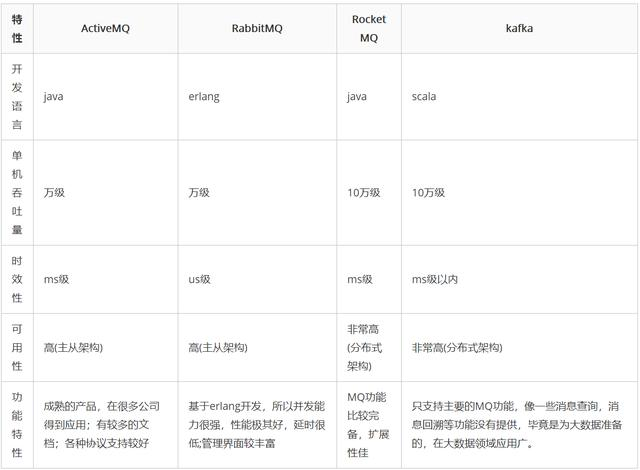

# MQ对比
## 介绍（做什么用）
MQ是一种消息中间件 ，主要用来解决复杂业务的解耦和异步处理，高并发系统中流量峭峰。

## MQ对比选型
现在开源主流的MQ中主要有`ActiveMq`,`RabbitMq`,`RocketMq`和`Kafka`。  

`ActiveMq`社区不活跃，并且有机率丢失数据，目前使用人数较少。  

`RabbitMq`是企业级的消息组件，由于支持多种协议导致较为重量级，并且使用的是`Erlang`开发，对`Java`开发人员来说很难深入理解与掌握。

`ActiveMq`与`RabbitMq`在吞吐量上只能达到万级，没办法达到十万级。
并且`RabbitMq`其实本质上只是提供了一个高可用机制，其核心队列是完全对等的，所以存在瓶颈。

`RabbitMq`与`Kafka`相比，两都是分布式架构，在可用性上都非常高。
`Kafka`支持的业务场景相对简单，只支持主要的MQ功能，如消息查询、消息回溯等功能都不支持。
`RabbitMq`比较适合复杂业务的使用场景，但是社区活跃度较低。

---

1.ActiveMQ
优点

 单机吞吐量：万级
 topic数量都吞吐量的影响：
 时效性：ms级
 可用性：高，基于主从架构实现高可用性
 消息可靠性：有较低的概率丢失数据
 功能支持：MQ领域的功能极其完备
缺点:

官方社区现在对ActiveMQ 5.x维护越来越少，较少在大规模吞吐的场景中使用。

2.Kafka
号称大数据的杀手锏，谈到大数据领域内的消息传输，则绕不开Kafka，这款为大数据而生的消息中间件，以其百万级TPS的吞吐量名声大噪，迅速成为大数据领域的宠儿，在数据采集、传输、存储的过程中发挥着举足轻重的作用。

Apache Kafka它最初由LinkedIn公司基于独特的设计实现为一个分布式的提交日志系统( a distributed commit log)，之后成为Apache项目的一部分。

目前已经被LinkedIn，Uber, Twitter, Netflix等大公司所采纳。

优点

 性能卓越，单机写入TPS约在百万条/秒，最大的优点，就是吞吐量高。
 时效性：ms级
 可用性：非常高，kafka是分布式的，一个数据多个副本，少数机器宕机，不会丢失数据，不会导致不可用
 消费者采用Pull方式获取消息, 消息有序, 通过控制能够保证所有消息被消费且仅被消费一次;
 有优秀的第三方Kafka Web管理界面Kafka-Manager；
 在日志领域比较成熟，被多家公司和多个开源项目使用；
 功能支持：功能较为简单，主要支持简单的MQ功能，在大数据领域的实时计算以及日志采集被大规模使用
缺点：

 Kafka单机超过64个队列/分区，Load会发生明显的飙高现象，队列越多，load越高，发送消息响应时间变长
 使用短轮询方式，实时性取决于轮询间隔时间；
 消费失败不支持重试；
 支持消息顺序，但是一台代理宕机后，就会产生消息乱序；
 社区更新较慢；

3.RabbitMQ
RabbitMQ 2007年发布，是一个在AMQP(高级消息队列协议)基础上完成的，可复用的企业消息系统，是当前最主流的消息中间件之一。

RabbitMQ优点：

 由于erlang语言的特性，mq 性能较好，高并发；
 吞吐量到万级，MQ功能比较完备  
 健壮、稳定、易用、跨平台、支持多种语言、文档齐全；
 开源提供的管理界面非常棒，用起来很好用  
 社区活跃度高；
RabbitMQ缺点：

 erlang开发，很难去看懂源码，基本职能依赖于开源社区的快速维护和修复bug，不利于做二次开发和维护。
 RabbitMQ确实吞吐量会低一些，这是因为他做的实现机制比较重。  
 需要学习比较复杂的接口和协议，学习和维护成本较高。

4.RocketMQ
RocketMQ出自 阿里公司的开源产品，用 Java 语言实现，在设计时参考了 Kafka，并做出了自己的一些改进。

RocketMQ在阿里集团被广泛应用在订单，交易，充值，流计算，消息推送，日志流式处理，binglog分发等场景。

RocketMQ优点：

 单机吞吐量：十万级
 可用性：非常高，分布式架构
 消息可靠性：经过参数优化配置，消息可以做到0丢失
 功能支持：MQ功能较为完善，还是分布式的，扩展性好
 支持10亿级别的消息堆积，不会因为堆积导致性能下降
 源码是java，我们可以自己阅读源码，定制自己公司的MQ，可以掌控
RocketMQ缺点：

 支持的客户端语言不多，目前是java及c++，其中c++不成熟；
 社区活跃度一般
 没有在 mq 核心中去实现JMS等接口，有些系统要迁移需要修改大量代码

消息队列选择建议

1.Kafka

Kafka主要特点是基于Pull的模式来处理消息消费，追求高吞吐量，一开始的目的就是用于日志收集和传输，适合产生大量数据的互联网服务的数据收集业务。

大型公司建议可以选用，如果有日志采集功能，肯定是首选kafka了。

2.RocketMQ

天生为金融互联网领域而生，对于可靠性要求很高的场景，尤其是电商里面的订单扣款，以及业务削峰，在大量交易涌入时，后端可能无法及时处理的情况。

RoketMQ在稳定性上可能更值得信赖，这些业务场景在阿里双11已经经历了多次考验，如果你的业务有上述并发场景，建议可以选择RocketMQ。

3.RabbitMQ

RabbitMQ :结合erlang语言本身的并发优势，性能较好，社区活跃度也比较高，但是不利于做二次开发和维护。不过，RabbitMQ的社区十分活跃，可以解决开发过程中遇到的bug。

如果你的数据量没有那么大，小公司优先选择功能比较完备的RabbitMQ。
