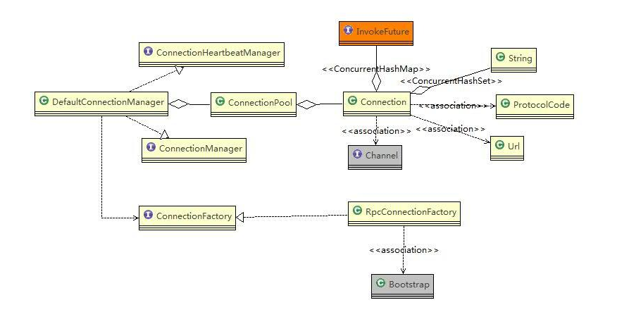

# 源码解析-连接管理

- 相关类图
  

- Connection 成员说明
  - Channel, io.netty.channel.Channel. Netty的Channel实例，代表一个实际连接通道
  - invokeFutureMap，ConcurrentHashMap<Integer, InvokeFuture>， 缓存连接上所有的客户端调用
  - url，com.alipay.remoting.Url，一个请求URL
  - poolKeys, ConcurrentHashSet<String>，连接池对应的key集合，key = IP:PORT
  - referenceCount, AtomicInteger， 表示该连接的使用次数。 放置到连接池中时，+1， 从连接池删除时，-1，当为0时，才允许被关闭
  -  attributes：类型为ConcurrentHashMap<String,Object>，缓存Connection相关的一些额外的属性信息；
  - CONNECTION、HEARTBEAT_COUNT、HEARTBEAT_SWITCH、PROTOCOL、VERSION：类型为AttributeKey<T>，主要用来在channel的属性集合中记录Connection对象、心跳数、心跳开关、协议码、协议版本号，以便在后续处理过程中使用；
