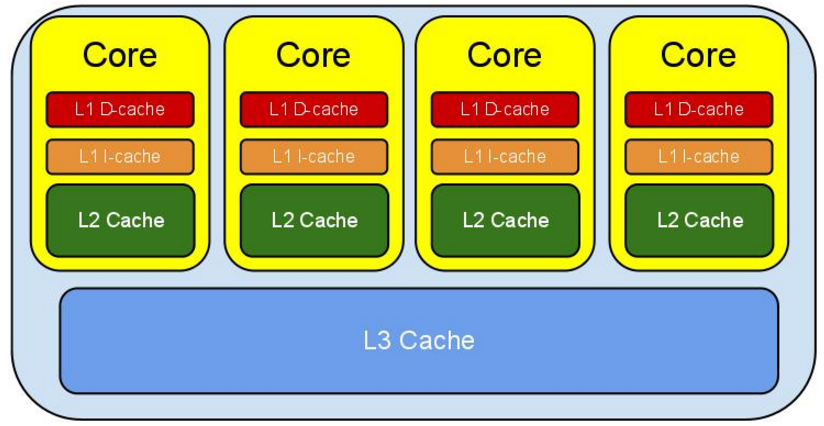
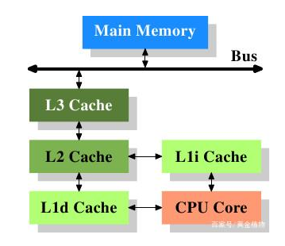

# CPU缓存理解

现代CPU的缓存结构一般分三层，L1，L2和L3

级别越小的缓存，越接近CPU，也就是说，速度越快，但容量越小。

`L1`是最接近`CPU`的，容量最小，速度最快，每个`CPU核`上都有一个`L1 Cache`。

`L1 Cache`分为数据缓存`L1d Cache`和指令缓存`L1i Cache`

`L2 Cache`容量较`L1`较大些，但是速度也相应的会慢一些。 每个`CPU核`上也都会有一个`L2 Cache`

`L3 Cache`是三级缓存中容量最大的一级，同时也是最慢的一级，在同一个`CPU插槽`中，共享一个`L3 Cache`

- CPU运行时缓存作用

当CPU运作时，它首先去L1寻找它所需要的数据，然后去L2，然后去L3。如果三级缓存都没找到它需要的数据，则从内存里获取数据。寻找的路径越长，耗时越长。所以如果要非常频繁的获取某些数据，保证这些数据在L1缓存里。这样速度将非常快。下表表示了CPU到各缓存和内存之间的大概速度：

|--|--|--|
|从CPU到|大约需要的CPU周期|大约需要的时间(单位ns)|
|寄存器|1|cycle|
|L1 Cache|~3-4 cycles|~0.5-1 ns|
|L2 Cache|~10-20 cycles|~3-7 ns|
|L3 Cache|~40-45 cycles|~15 ns|
|跨槽传输||~20 ns|
|内存|~120-240 cycles| ~60-120ns|
