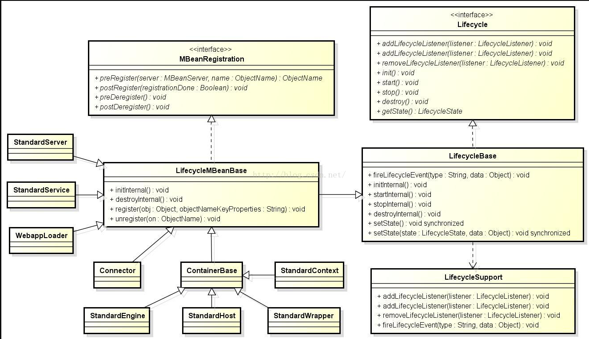

# tomcat9: StandardServer

```
-> StandardServer#init 在 Catalina#load中调用
--> StandardServer/LifecycleMBeanBase/LifecycleBase#init
----> StandardServer#initInternal
------> StandardServer/LifecycleMBeanBase#initInternal 容器注册MBean type=Server
------> MBean注册....
------> 验证 META-INF/MANIFEST.MF
------> services[i]#init StandardService#init

-> StandardServer#start 在Catalina#start中调用
--> StandardServer/LifecycleMBeanBase#start
----> StandardServer#startInternal
------> StandardServer#service[i]#start 调用StandardService#start
------> StandardServer#startPeriodicLifecycleEvent 生命周期监听
--------> StandardServer/LifecycleMBeanBase#fireLifecycleEvent
```
  - [StandardService相关](./StandardService.md)


- 生命周期相关类图

