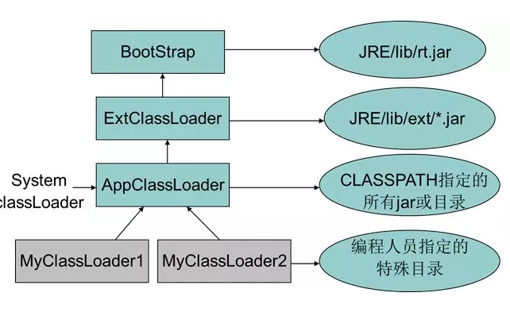
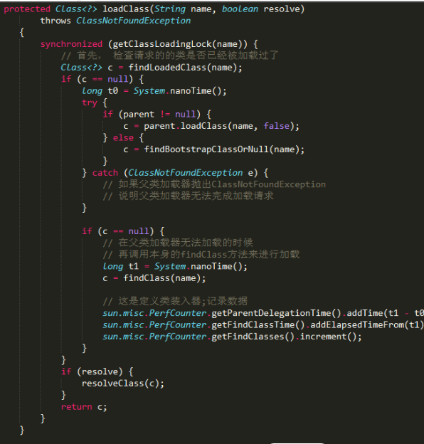
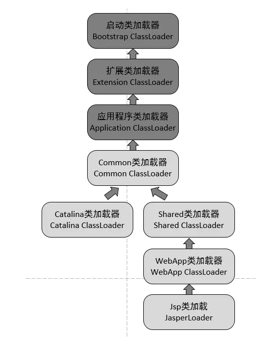

# 双亲委任模型
- 启动类加载器（`Bootstrap ClassLoader`)， 这个类加载器使用C++实现（`HotSpot`），是虚拟机本身的一部份
- 其他类加载器由JAVA语言实现，独立于虚拟机，全部继承`java.lang.ClassLoader`

启动类加载器（Bootstrap ClassLoader）：这个类加载器复杂将存放在 JAVA_HOME/lib 目录中的，或者被-Xbootclasspath 参数所指定的路径种的，并且是虚拟机识别的（仅按照文件名识别，如rt.jar，名字不符合的类库即使放在lib目录下也不会重载）。

扩展类加载器（Extension ClassLoader）：这个类加载器由sun.misc.Launcher$ExtClassLoader实现，它负责夹杂JAVA_HOME/lib/ext 目录下的，或者被java.ext.dirs 系统变量所指定的路径种的所有类库。开发者可以直接使用扩展类加载器。

应用程序类加载器（Application ClassLoader）：这个类加载器由sun.misc.Launcher$AppClassLoader 实现。由于这个类加载器是ClassLoader 种的getSystemClassLoader方法的返回值，所以也成为系统类加载器。它负责加载用户类路径（ClassPath）上所指定的类库。开发者可以直接使用这个类加载器，如果应用中没有定义过自己的类加载器，一般情况下这个就是程序中默认的类加载器。

图中各个类加载器之间的关系成为 类加载器的双亲委派模型（Parents Dlegation Mode）。双亲委派模型要求除了顶层的启动类加载器之外，其余的类加载器都应当由自己的父类加载器加载，这里类加载器之间的父子关系一般不会以继承的关系来实现，而是都使用组合关系来复用父加载器的代码。

类加载器的双亲委派模型在JDK1.2 期间被引入并被广泛应用于之后的所有Java程序中，但他并不是个强制性的约束模型，而是Java设计者推荐给开发者的一种类加载器实现方式。

双亲委派模型的工作过程是：如果一个类加载器收到了类加载的请求，他首先不会自己去尝试加载这个类，而是把这个请求委派父类加载器去完成。每一个层次的类加载器都是如此，因此所有的加载请求最终都应该传送到顶层的启动类加载器中，只有当父加载器反馈自己无法完成这个请求（他的搜索范围中没有找到所需的类）时，子加载器才会尝试自己去加载。

如果没有使用双亲委派模型，由各个类加载器自行加载的话，如果用户自己编写了一个称为java.lang.Object的类，并放在程序的ClassPath中，那系统将会出现多个不同的Object类， Java类型体系中最基础的行为就无法保证。应用程序也将会变得一片混乱。

先检查是否已经被加载过，若没有加载则调用父加载器的loadClass方法， 如父加载器为空则默认使用启动类加载器作为父加载器。如果父类加载失败，抛出ClassNotFoundException 异常后，再调用自己的findClass方法进行加载。

## 如何破坏双亲委任模型？

双亲委任模型不是一个强制性的约束模型，而是一个建议型的类加载器实现方式。

JNDI现在已经是Java的标准服务，它的代码由启动类加载器去加载（在JDK1.3时就放进去的rt.jar）,但它需要调用由独立厂商实现并部署在应用程序的ClassPath下的JNDI接口提供者（SPI， Service Provider Interface）的代码，但启动类加载器不可能“认识“这些代码啊。因为这些类不在rt.jar中，但是启动类加载器又需要加载。怎么办呢？

为了解决这个问题，Java设计团队只好引入了一个不太优雅的设计：线程上下文类加载器（Thread Context ClassLoader）。这个类加载器可以通过java.lang.Thread类的setContextClassLoader方法进行设置。如果创建线程时还未设置，它将会从父线程中继承一个，如果在应用程序的全局范围内都没有设置过多的话，那这个类加载器默认即使应用程序类加载器。

JNDI服务使用这个线程上下文加载器去加载所需要的SPI代码，也就是父类加载器请求子类加载器去完成类加载的动作，这种行为实际上就是打通了双亲委派模型的层次结构来逆向使用类加载器，实际上已经违背了双亲委派模型的一般性原则。

Java中所有涉及SPI的加载动作基本胜都采用这种方式。例如JNDI，JDBC，JCE，JAXB，JBI等。

实现热插拔，热部署，模块化，意思是添加一个功能或减去一个功能不用重启，只需要把这模块连同类加载器一起换掉就实现了代码的热替换。

Java 程序中基本有一个共识：OSGI对类加载器的使用时值得学习的，弄懂了OSGI的实现，就可以算是掌握了类加载器的精髓。

## Tomcat类加载器

CommonClassLoader、CatalinaClassLoader、SharedClassLoader和WebappClassLoader则是Tomcat自己定义的类加载器，它们分别加载/common/*、/server/*、/shared/*（在tomcat 6之后已经合并到根目录下的lib目录下）和/WebApp/WEB-INF/*中的Java类库。其中WebApp类加载器和Jsp类加载器通常会存在多个实例，每一个Web应用程序对应一个WebApp类加载器，每一个JSP文件对应一个Jsp类加载器。

- commonLoader：Tomcat最基本的类加载器，加载路径中的class可以被Tomcat容器本身以及各个Webapp访问；
- catalinaLoader：Tomcat容器私有的类加载器，加载路径中的class对于Webapp不可见；
- sharedLoader：各个Webapp共享的类加载器，加载路径中的class对于所有Webapp可见，但是对于Tomcat容器不可见；
- WebappClassLoader：各个Webapp私有的类加载器，加载路径中的class只对当前Webapp可见；

CommonClassLoader能加载的类都可以被Catalina ClassLoader和SharedClassLoader使用，从而实现了公有类库的共用，而CatalinaClassLoader和Shared ClassLoader自己能加载的类则与对方相互隔离。

WebAppClassLoader可以使用SharedClassLoader加载到的类，但各个WebAppClassLoader实例之间相互隔离。

而JasperLoader的加载范围仅仅是这个JSP文件所编译出来的那一个.Class文件，它出现的目的就是为了被丢弃：当Web容器检测到JSP文件被修改时，会替换掉目前的JasperLoader的实例，并通过再建立一个新的Jsp类加载器来实现JSP文件的HotSwap功能。
