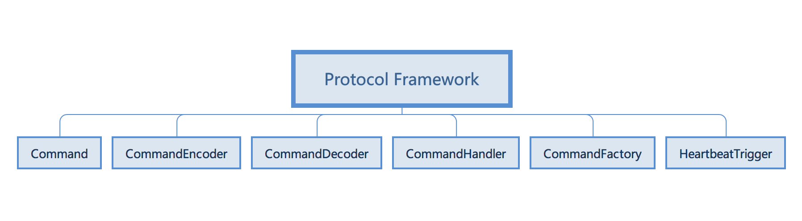
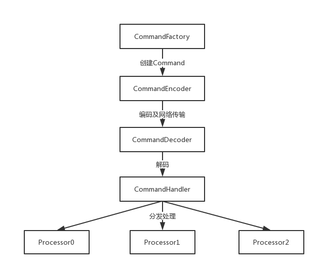
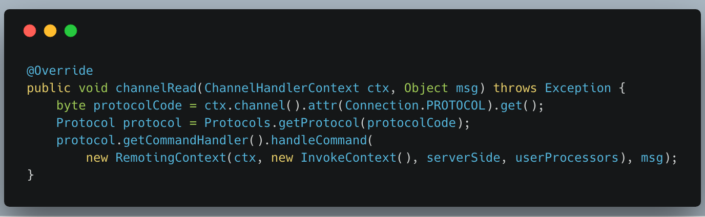

# 协议框架
[参考官方文档](https://www.sofastack.tech/posts/2018-12-06-01)

协议框架 协议框架（protocol-skeleton）包含命令处理器、编解码器等，是底层通信能力之上，具体私有协议之下，连接通信能力和私有协议的中间层。网络通信层是SOFABolt对Netty的封装和功能增强，协议框架则是SOFABolt对网络请求处理流程的抽象，是用户可以不关心底层细节快速实现自己的处理器来完成网络请求的处理逻辑，是用户可以进行拓展来实现自定义的私有协议的基础。

- Command：协议命令，通讯数据的顶层抽象。从交互的角度可以分为Request（请求）于Response（响应），从功能的角度，分为负载命令（交换业务数据）和控制命令（进行系统的管理、协调等）。
- CommandEncoder/CommandDecoder：协议命令的编解码器，自定义协议实现的基础，编解码器完成对象和字节数组之间的相互转换。
- CommandHandler：协议命令的处理器，命令处理入口，负责分发、处理命令。
- CommandFactory：协议命令工厂类，负责创建协议命令对象。
- HeartbeatTrigger：心跳的处理器，用户用户拓展特定的心跳机制的处理。

- 请求处理流程
  1. 通过CommandFactory构建请求对象
  2. 通过CommandEncoder对请求对象进行编码，写入到网络连接
  3. 服务端从连接中读取数据，通过CommandDecoder解析成请求对象
  4. CommandHandler接收请求对象，进行分发和处理

  

- CommandHandler对请求的分发和处理

从连接的上下文中获取使用的协议版本ProtocolCode，然后根据协议版本从ProtocolManager中获取具体的协议，再从协议中获取CommandHandler来处理信息体。
